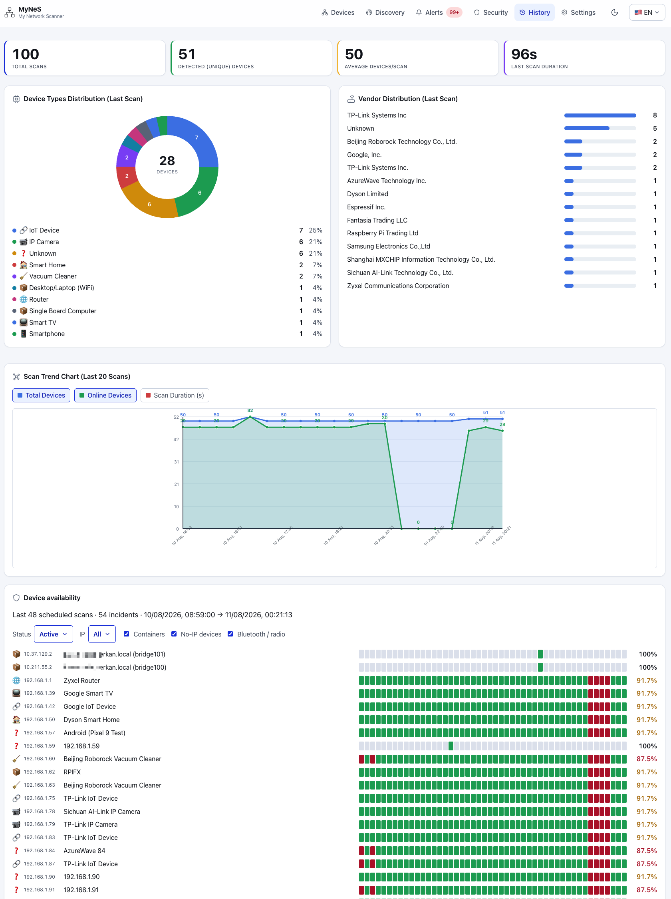
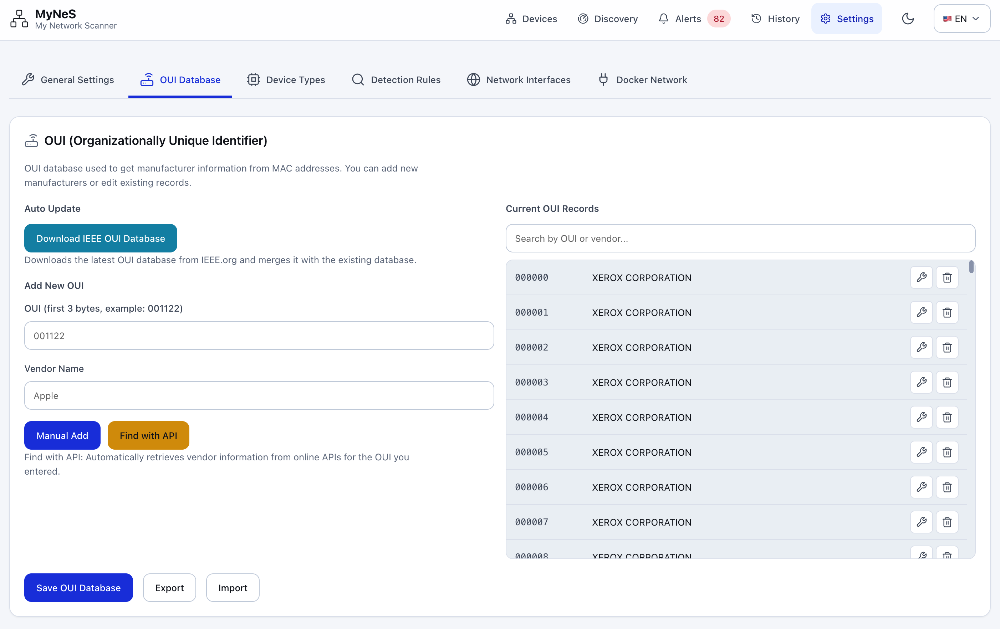
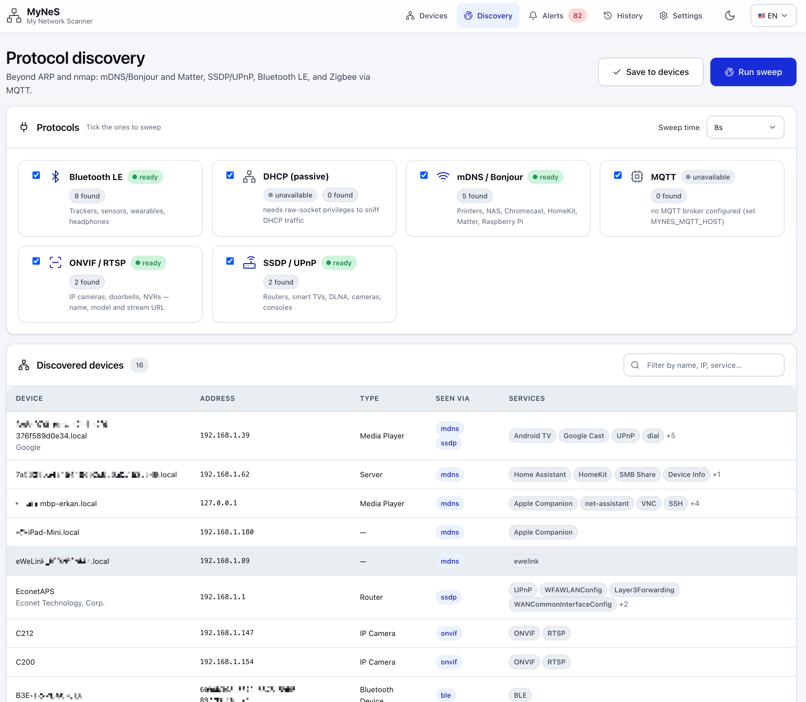
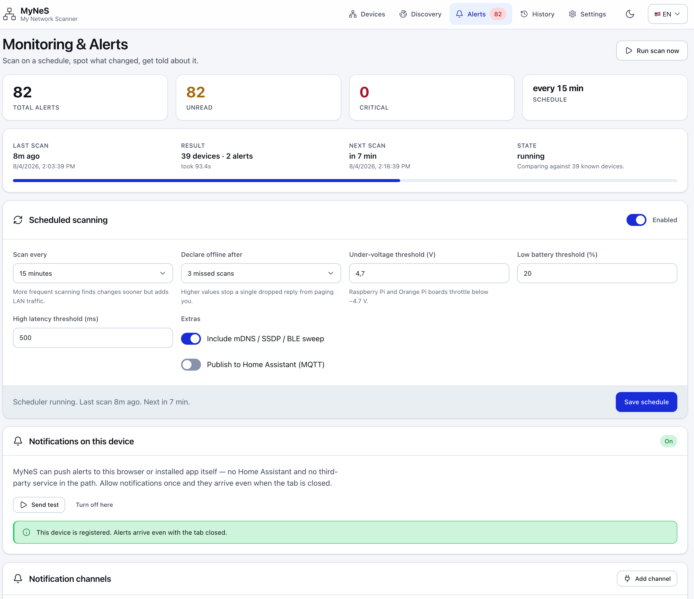
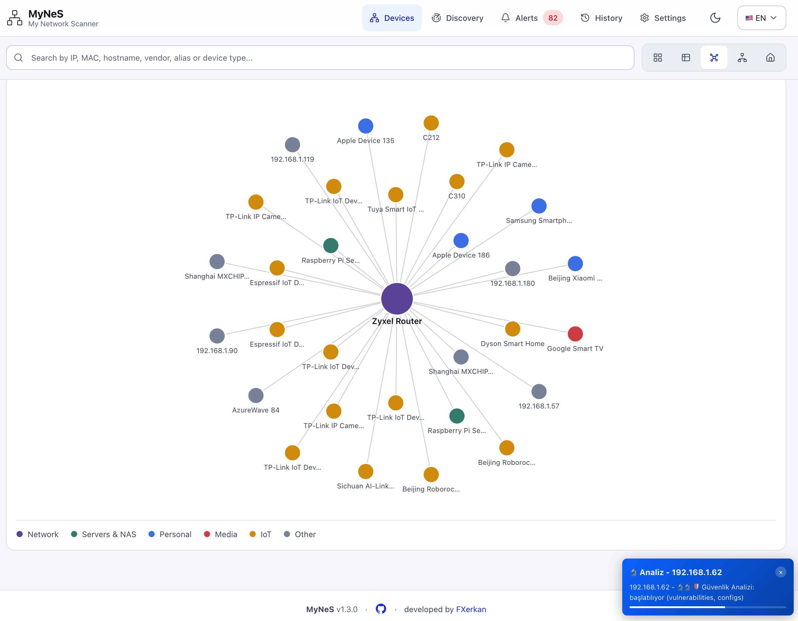
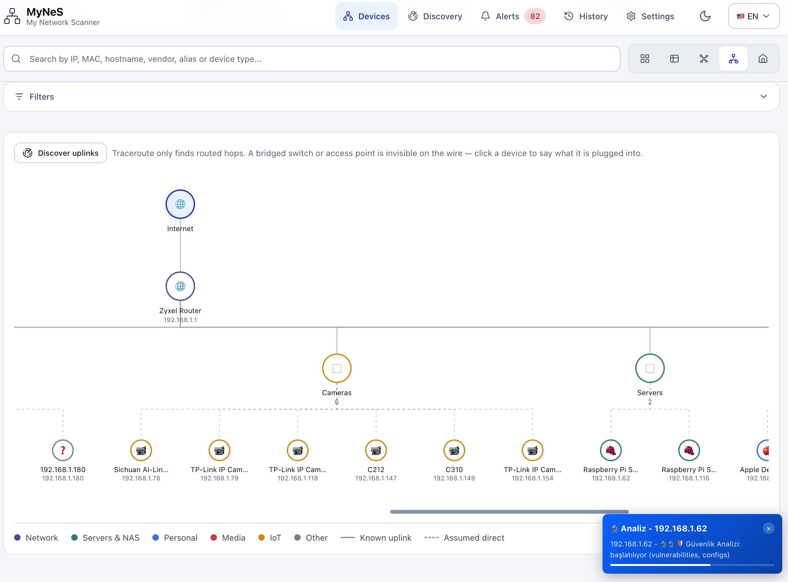
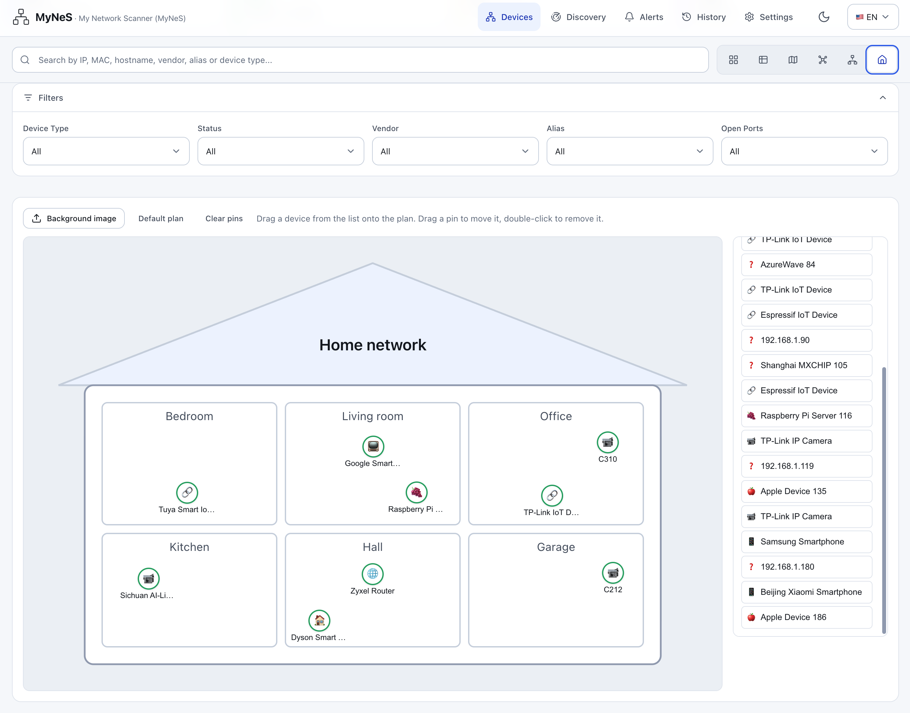
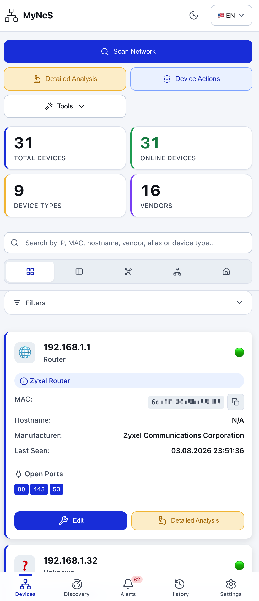
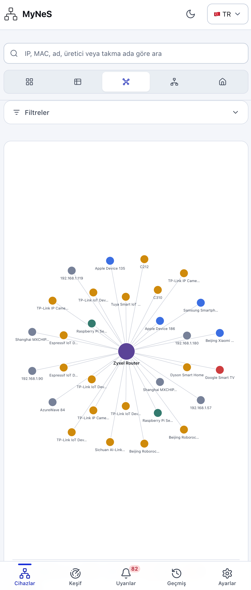
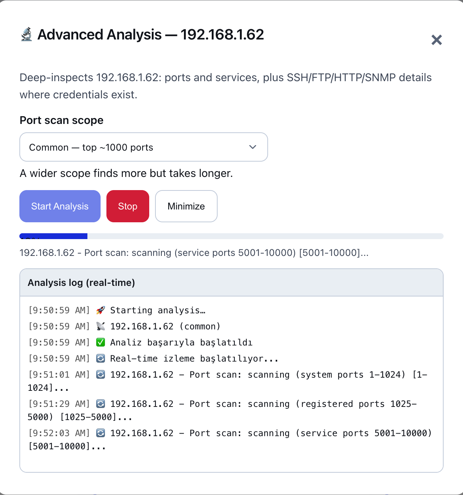

# Changelog

All notable changes to MyNeS (My Network Scanner) are documented here.
Format loosely follows [Keep a Changelog](https://keepachangelog.com/1.1.0/);
versioning follows [SemVer](https://semver.org/).

## [Unreleased]

### Added

- **Bluetooth LE discovery actually works in a container.** The README, the
  add-on description and the marketplace listings have all promised "including
  the Zigbee, Z-Wave, Matter and Bluetooth LE ones an IP scan cannot find" since
  1.3.0, but `deploy/requirements-docker.txt` left `bleak` out on the grounds
  that "containers have no BLE adapter". That is true of a bridged container and
  false of the way MyNeS is actually deployed: `network_mode: host` on a box
  whose `bluetoothd` is already running. bleak does not drive the radio on
  Linux, it asks BlueZ over the D-Bus system bus — so the image needs no BlueZ
  packages, no USB passthrough and no `privileged: true`, only the bus socket
  mounted at run time. The image now ships `bleak`, and the manifests mount
  `/run/dbus/system_bus_socket`. The app still runs as the unprivileged
  `scanner` user; BlueZ's default D-Bus policy already allows it.

### Fixed

- **`ble: ok` while finding nothing.** `available()` only checked that `bleak`
  imports, which says nothing about whether the bus is reachable. A container
  without the socket therefore reported the backend as healthy with a count of
  zero — identical to a scan that legitimately found no BLE devices — and the
  underlying failure surfaced only as a logged `[Errno 2] No such file or
  directory`. The backend now checks for the system bus up front and reports the
  mount that is missing, so `/api/capabilities` and the Discovery page name the
  cause. The check tests for a *socket* rather than mere existence, because
  docker creates an empty directory at a bind mount whose source is absent,
  which would otherwise look healthy and fail later.

## [1.4.0] — 2026-08-04

Everything here came out of installing 1.3.0 from the CasaOS store onto a
Raspberry Pi and using it. None of it reproduces on a dev machine, which is
why it all shipped.

### Fixed

- **Raw ARP in a container.** `cap_add: NET_ADMIN/NET_RAW` grants nothing to a
  non-root process — the capabilities land in the bounding set and never in the
  effective one, so every container install silently fell back to a ping sweep.
  The Dockerfile now `setcap`s the interpreter, which survives the drop to the
  `scanner` user, and the entrypoint starts as root only long enough to hand
  over the docker socket's group before `exec gosu scanner`.
- **Docker integration never connected** (`mynes/integrations/docker.py`), three
  independent bugs stacked: the socket path was assigned *after* the probe that
  reads it, so the `AttributeError` was swallowed as "Docker is not installed";
  the socket client asked `requests` for `http+unix://`, which it cannot do
  without `requests-unixsocket`; and container detection read `/proc/1/cgroup`,
  which says `0::/` under cgroup v2 whether you are in a container or not. The
  Engine API now goes over `http.client` on an `AF_UNIX` socket — stdlib only —
  and the manifests mount the socket.
- **Every docker bridge showed the same device name.** A host with a dozen
  containers has a dozen bridges, all classified `Docker`, all rendering as an
  identical `<host> (Docker)` in the list, the graph and the topology view.
  They are now labelled with the docker network behind them
  (`<host> (docker: mynes_default)`), falling back to the interface name.
- **The sign-in gate could not be turned on where it matters.** Credentials were
  environment-only and the UI said "add these to `.env` and restart" — advice
  with no meaning inside a store-installed container. Settings now takes a
  username and password directly (`POST /api/auth/credentials`) and stores a
  PBKDF2 hash in `data/security.json`, mode 600. Environment variables still
  win, and the endpoint refuses to overwrite them.
- **"Notifications: Unsupported" was a misleading diagnosis.** Browsers hide
  `serviceWorker`/`PushManager` entirely on an insecure origin, so a plain
  `http://<lan-ip>` page is indistinguishable from an ancient browser. The UI
  now names the real cause, and `MYNES_TLS=adhoc` (or `MYNES_TLS_CERT`/`_KEY`)
  serves https so push actually works. `pywebpush` is now in the image; without
  it the server half was missing regardless.
- **Installing the background service crashed inside a container**, where it
  went looking for `systemctl`. It is reported as not applicable now — the
  scheduler already runs in-process and restarts are the runtime's job.

### Notes

- Mounting `/var/run/docker.sock` is optional in every manifest. Drop the line
  and everything except the Docker panel keeps working.
- Bluetooth LE stays out of the image on purpose: a container has no adapter.

## [1.3.0] — 2026-08-04

### Added

- **MyNeS sends its own notifications** (`mynes/monitoring/push.py`). Web Push
  straight from this server to the browser or the installed PWA — no Home
  Assistant, no ntfy, no relay in the path. Allow notifications once per device
  and alerts arrive with the tab closed.
  - VAPID key pair is generated on first use into `config/.vapid_key`
    (mode 600, gitignored); subscriptions live in
    `data/push_subscriptions.json`.
  - A subscription the push service reports as gone (404/410) is pruned
    automatically — an uninstalled PWA would otherwise fail on every alert.
  - Enabling it on a device also creates the `mynes_push` channel if it is
    missing, so alerts do not silently go nowhere after granting permission.
  - Optional dependency: `pip install 'mynes[push]'` (pywebpush). Without it
    the channel reports itself unavailable and everything else keeps working.
  - Subscriptions are stored as opaque records tagged with a `kind`, so the
    Phase-2 mobile app can register an Expo/FCM token in the same table
    instead of needing a second one.
  - New endpoints: `GET /api/push/key`, `GET /api/push/subscriptions`,
    `POST /api/push/subscribe`, `POST /api/push/unsubscribe`,
    `POST /api/push/test`. `/api/capabilities` reports push availability and
    the registered device count.
- **Home Assistant notify channel.** Calls a `notify.*` service directly over
  the REST API with the token already configured — unlike the webhook channel
  it needs no automation built in Home Assistant first. The channel picker
  lists the services the install actually exposes
  (`GET /api/integrations/home-assistant/notify-services`), so nobody has to
  guess `notify.mobile_app_<slug>`. Defaults to `persistent_notification`,
  which exists everywhere.

Both ride the existing rule and severity filters, so "new device found" and
"device unreachable" reach either destination with no extra configuration.

## [1.2.0] — 2026-08-04

### Added

- **Three new layouts in the device view's layout switch.**
  - *Graph* — force-directed cloud, subnet gateways drawn as hubs, device
    category by colour. No charting dependency; the layout is ~40 lines of
    spring/repulsion in `static/js/views.js`.
  - *Topology* — the real chain, `Internet → router → switch/AP → group →
    device`, with devices bucketed into 17 named groups (Lights, Cameras,
    Climates, Medias, Pets, Servers, Computers, Phones, Tablets, Access
    Points, Vacuums, Switches, Sensors, IoT Devices, TVs, Smart Home, Other).
  - *Home plan* — a floor plan with drag-and-drop device pins. Room names are
    editable, the background can be replaced with the user's own image
    (downscaled to 1600px before it is stored), and pin positions are kept as
    fractions so the plan stays correct at any width.
- **Uplink discovery** (`mynes/core/topology.py`, `/api/topology`). Answers
  "what is this device plugged into" from three sources, most-trusted first:
  a hand-assigned uplink, a traceroute-discovered routed hop, then
  assumed-direct. Known edges draw solid, assumed ones dashed. An unmanaged
  switch is invisible at layer 3, so the manual assignment is the only way to
  record one — the UI says so rather than guessing.

### Changed

- **History page** rebuilt on the design system: KPI tiles match the Devices
  page, charts carry data labels and a legend with counts and percentages,
  and the donut/trend series read their colours from shared `--chart-*`
  tokens so they work in both themes.

- **Settings page** rebuilt on the design system. Device Types is a card grid
  with legible icons instead of a cramped scroll box; detection rules show the
  device type each pattern maps to, as an editable dropdown.
- **Header and footer.** The brand is now "MyNeS" over "My Network Scanner";
  the footer carries the version, a GitHub link and the author, without the
  commit hash.
- New app icon and favicon, replacing the emoji-in-an-SVG placeholder.
- "Advanced Analysis" is called **Detailed Analysis** everywhere, and the
  action-button icons come from the sprite at a legible size.
- The version is a constant in `mynes/core/version.py` instead of a
  git-describe string; users were being shown things like `1.0.5-f5cfbb2+`.

### Fixed

- **Settings took seconds to become usable**: the 1.5 MB OUI database was
  fetched and parsed during page load, blocking every other tab. It is now
  loaded when its own tab is first opened, and the list renders at most 200
  matching rows instead of building 40,000 DOM nodes. Search filters the data
  (debounced) rather than walking every node.

- Vendor bars on the History page overflowed their card — a 510px fixed-width
  name column, now a grid.
- Trend chart labels and history dates were hardcoded Turkish and appeared
  untranslated on the English page.
- The built-in home floor plan was invisible on the light theme.
- Table headers used the inverted palette, which came out white in dark mode.
- Card action buttons sat at different heights depending on card content;
  they now align to the bottom edge.
- Turkish and English translation tables are complete and in sync (both 549
  keys); the settings page no longer has hardcoded Turkish strings.

### Removed

- The Network Map layout. The graph and topology views replace it. The
  service worker cache version was bumped so the removed button does not
  linger in an already-installed PWA shell.

## [1.1.0] — 2026-08-04

This release is built around one idea: **a home network is not just IP addresses.**
An ARP scan cannot see a Zigbee bulb, a Bluetooth tracker or a Matter sensor,
so v2 adds a discovery layer per protocol, a monitoring loop that tells you
when something changes, and a Home Assistant integration that works in both
directions.

### Added

#### Protocol discovery — beyond ARP and nmap

A new `mynes/discovery/` package, one isolated module per protocol. Every
backend reports `available() -> (bool, reason)` and a dead protocol yields an
empty list instead of breaking the scan.

| Protocol | Finds |
|---|---|
| mDNS / Bonjour (`zeroconf`) | Printers, NAS, Chromecast, HomeKit, **Matter** (`_matter._tcp` / `_matterc._udp`), Raspberry Pi |
| SSDP / UPnP (stdlib sockets, zero deps) | Routers, smart TVs, DLNA, cameras, consoles |
| ONVIF / RTSP | IP cameras, doorbells, NVRs — name, model and stream URL |
| Bluetooth LE (`bleak`) | Trackers, sensors, wearables, headphones — keyed by BT address, no IP |
| MQTT | Zigbee2MQTT, Z-Wave JS, Tasmota and HA-discovery retained topics — the only way to see radio devices |
| DHCP (passive) | Devices that announce themselves; needs raw-socket privileges |

#### Monitoring & alerts

- `monitoring/rules.py` — **pure** `(previous, current) -> [Alert]` functions,
  no I/O, so the diff logic is testable without a network.
- `monitoring/scheduler.py` — one daemon thread: scan → diff → alert → notify,
  on a configurable interval.
- Rules for: new device, device offline (after N missed scans), back online,
  IP change, new open port, weak BLE signal, under-voltage and low battery
  (Raspberry Pi / Orange Pi boards throttle below ~4.7 V).
- `monitoring/notify.py` — stdlib-only channels: generic webhook, Slack,
  Discord, ntfy, Telegram and SMTP. Adding a channel = adding one function to
  `SENDERS`.
- Capped JSON alert history with severity filter, mark-read and clear.

#### Home Assistant integration, both directions

- **Push** — MQTT Discovery publishes each device as a `device_tracker`, so
  MyNeS devices show up in HA without a custom component.
- **Pull & compare** — reads HA's **device registry over WebSocket** (not just
  `/api/states`), so Zigbee, Z-Wave, Matter, Bluetooth and Cloud devices that
  have no IP are still matched. Comparison is by normalised IP **and** MAC, so
  a device HA calls `192_168_1_79` and MyNeS calls `192.168.1.79` counts once.
- `scripts/ha_compare.py` — a token-safe CLI diff (`in_both`, HA-only,
  MyNeS-only) that never prints your token.
- Credentials read from `MYNES_HA_URL`/`MYNES_HA_TOKEN` or bare
  `HA_URL`/`HA_TOKEN`.

#### Six device views

The Devices page gained a view switcher. Card and Table were there before;
Map, **Graph**, **Topology** and **Home** are new.

**Graph view** — a force-directed map of the LAN, devices coloured by category
(Network, Servers & NAS, Personal, Media, IoT, Other) around the gateway.

**Topology diagram** — the physical shape of the network: Internet → router →
device groups. `Discover uplinks` runs a traceroute pass, and because a bridged
switch or access point is invisible on the wire, you can click a device and say
what it is plugged into. Solid lines are known uplinks, dashed are assumed
direct.

**Home view** — a floor plan. Drop a device onto a room to pin it, drag to move,
double-click to remove. Ships with a default plan and accepts your own
background image; the sidebar lists everything not yet placed, grouped by type.

#### Desktop platform integration (`mynes/platform/`)

- `privileges.py` — the narrow, permanent privilege fix per OS instead of
  "run everything as root": Linux `setcap`, macOS ChmodBPF + `access_bpf`
  group, Windows Npcap. It **prints** the commands by default and only runs
  them with `--apply`, so the password prompt appears in the user's own
  terminal. A web request can never escalate privileges.
- `service.py` — run MyNeS in the background at login via a launchd
  LaunchAgent (macOS), a `systemd --user` unit (Linux) or a Scheduled Task
  (Windows). All **user-level**: no sudo, uninstall is deleting one file.
- `tray.py` — optional menu-bar / notification-area icon (`pystray`).

#### Web app

- `static/css/design-system.css` — semantic tokens (`--bg-surface`,
  `--text-primary`, `--severity-*`) as the single source of style truth. Page
  CSS never hardcodes a colour.
- **Dark mode**, first-class alongside light. OS preference is the default;
  `[data-theme]` on `<html>` overrides it in either direction.
- **PWA** — `manifest.webmanifest` plus a network-first service worker, so the
  app installs to a phone home screen and survives a flaky Wi-Fi hop.
- **SVG icon sprite** (`templates/_icons.html`) replacing emoji as UI icons.
- **Turkish and English** UI via `web/i18n.py` and `web/locales/{tr,en}/`.
- Accessibility: visible focus rings, 44px minimum tap targets,
  `prefers-reduced-motion` respected.

  
  

- New `/api` v2 blueprint: `/api/discovery`, `/monitoring`, `/alerts`,
  `/notifications`, `/integrations`, `/health`, `/capabilities`.
- **`/api/capabilities`** exists because "it only found two devices" is a
  permissions problem, not a bug report — it reports exactly which privilege
  or dependency is missing and how to fix it.

#### Other

- `scripts/run.py` — one command on any OS: creates the venv, installs deps,
  checks for nmap, runs the app.
- Docker image published from CI; host networking documented, because that is
  what makes LAN discovery work in a container.
- Credential storage encrypted with Fernet + PBKDF2-HMAC-SHA256 (100k
  iterations); `security/sanitizer.py` strips sensitive fields before export.

Detailed per-device analysis — services, system information and security
findings behind one button:

- `docs/PHASE2_MOBILE.md` — the React Native / Expo plan and the server-side
  prerequisites (token auth, CORS, QR pairing, frozen `/api/devices`, SSE
  progress) to get right in Phase 1.

### Changed

- **Restructured into a `mynes/` package** — `core`, `discovery`, `analysis`,
  `integrations`, `monitoring`, `platform`, `security`, `web`. This is a
  breaking change to import paths and file locations.
- Paths resolve from the package, not the current directory, with
  `MYNES_HOME` / `MYNES_CONFIG_DIR` / `MYNES_DATA_DIR` overrides — so the app
  behaves the same whether launched from a shell, a service or Docker.
- `.env` in the repo root is loaded by `mynes/__init__.py`, so every entry
  point picks it up. Real environment variables always win over the file.
- Every non-trivial module carries a runnable `demo()` with asserts, wired
  into `tests/` by a one-line test.
- README install and structure sections rewritten for v2.

### Fixed

- **Scanning without root returned almost nothing.** Raw ARP (`scapy.srp`)
  needs root; the failure was swallowed and produced an empty list —
  **2 devices reported where 29 existed.** There is now an explicit ping sweep
  + OS ARP cache fallback, and the chosen method is surfaced through
  `scanner.last_arp_method` and `scanner.privilege_hint`. A permission failure
  is never silent again.
- **The monitor announced the entire network as new devices.** With no stored
  baseline the first scheduled scan diffed against nothing and fired 49 "new
  device" alerts. The baseline is now seeded from the current device list on
  first run.
- Bluetooth devices with CoreBluetooth MAC-shaped UUIDs no longer generate a
  fresh "new device" alert on every scan.
- HA comparison counted the same device twice when HA and MyNeS spelled its
  identifier differently.
- `service.py` launches `sys.executable`, **not** `os.path.realpath(...)` —
  resolving a venv's `bin/python` lands on the base interpreter where `mynes`
  is not installed, and the service exited 1 on every start.
- `launchctl list` exits 0 for a job that is loaded but dead, and `unload`
  returns before the child is gone. Status is now read from the PID field and
  uninstall waits for the process to actually exit — otherwise an orphan kept
  holding port 5883.
- Alert timeline shows relative time ("6m ago") instead of absolute
  timestamps.
- Vendor identification fixes: "UPnP", "EX3501-T0 ZYXEL",
  "Google TV Streamer".

### Security

- `config/config.json` is tracked in git, so secrets must never be written
  there. The master password comes from `MYNES_PASSWORD` or
  `config/.master_password` (gitignored, mode 600), auto-generated if absent.
  `tests/test_smoke.py` asserts this.

---

## [1.x] — before 2026-08-03

Flat-layout Flask app: ARP + nmap scanning, device identification from an OUI
database, card and table views, JSON persistence and a config page. See the
tags `v1.0.3` … `v1.0.5`.
