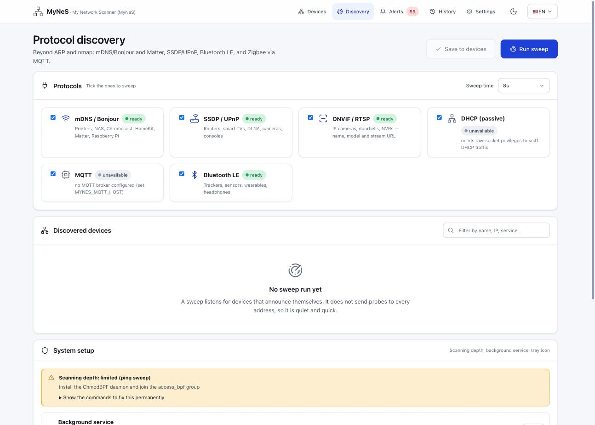
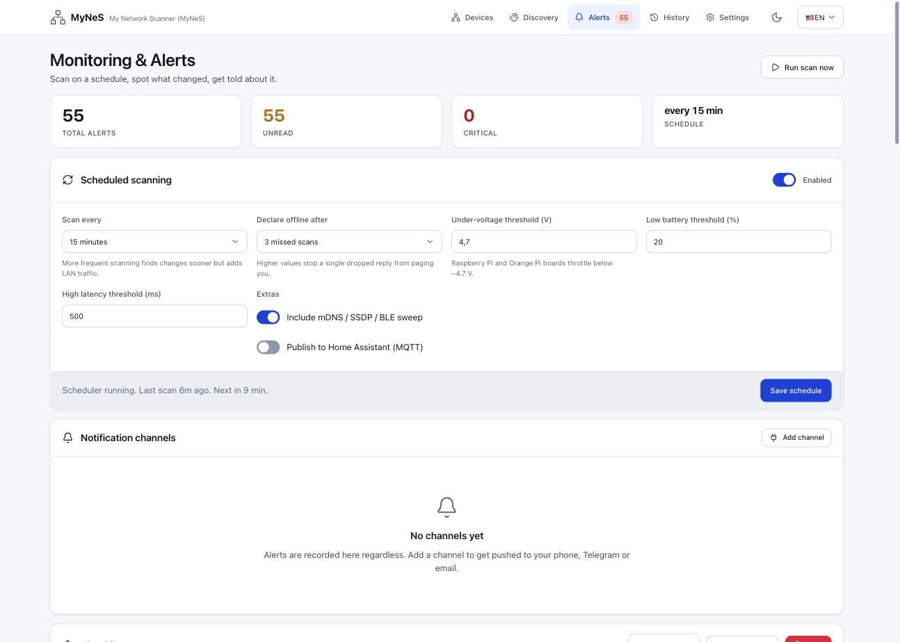
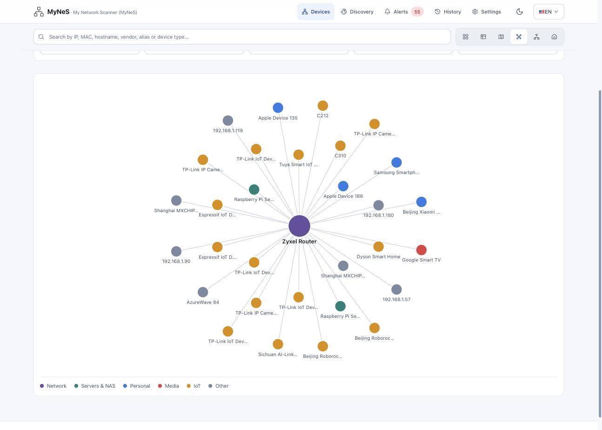
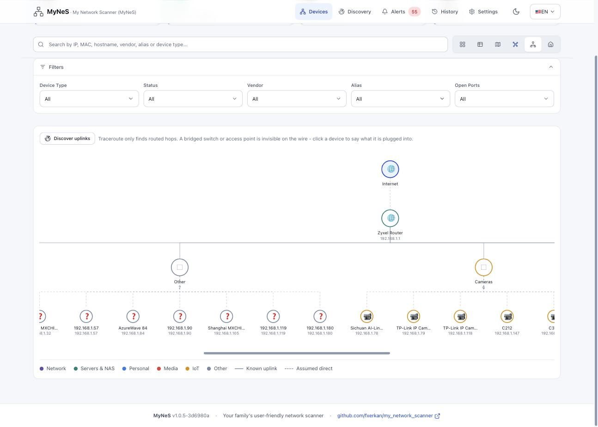
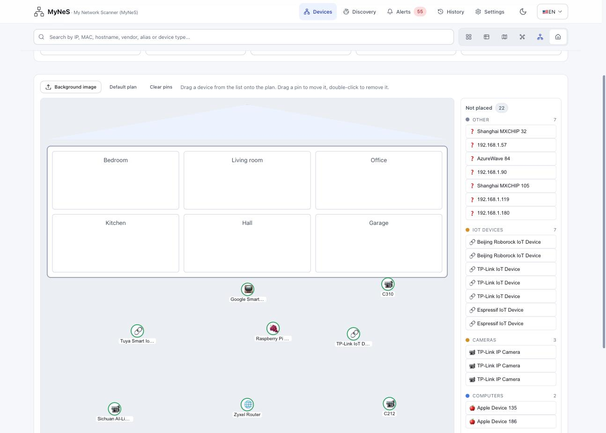

# Changelog

All notable changes to MyNeS (My Network Scanner) are documented here.
Format loosely follows [Keep a Changelog](https://keepachangelog.com/1.1.0/);
versioning follows [SemVer](https://semver.org/).

## [2.0.0] — 2026-08-04

v2 is a rewrite around one idea: **a home network is not just IP addresses.**
An ARP scan cannot see a Zigbee bulb, a Bluetooth tracker or a Matter sensor,
so v2 adds a discovery layer per protocol, a monitoring loop that tells you
when something changes, and a Home Assistant integration that works in both
directions.

### Added

#### Protocol discovery — beyond ARP and nmap

A new `mynes/discovery/` package, one isolated module per protocol. Every
backend reports `available() -> (bool, reason)` and a dead protocol yields an
empty list instead of breaking the scan.

| Protocol | Finds |
|---|---|
| mDNS / Bonjour (`zeroconf`) | Printers, NAS, Chromecast, HomeKit, **Matter** (`_matter._tcp` / `_matterc._udp`), Raspberry Pi |
| SSDP / UPnP (stdlib sockets, zero deps) | Routers, smart TVs, DLNA, cameras, consoles |
| ONVIF / RTSP | IP cameras, doorbells, NVRs — name, model and stream URL |
| Bluetooth LE (`bleak`) | Trackers, sensors, wearables, headphones — keyed by BT address, no IP |
| MQTT | Zigbee2MQTT, Z-Wave JS, Tasmota and HA-discovery retained topics — the only way to see radio devices |
| DHCP (passive) | Devices that announce themselves; needs raw-socket privileges |

#### Monitoring & alerts

- `monitoring/rules.py` — **pure** `(previous, current) -> [Alert]` functions,
  no I/O, so the diff logic is testable without a network.
- `monitoring/scheduler.py` — one daemon thread: scan → diff → alert → notify,
  on a configurable interval.
- Rules for: new device, device offline (after N missed scans), back online,
  IP change, new open port, weak BLE signal, under-voltage and low battery
  (Raspberry Pi / Orange Pi boards throttle below ~4.7 V).
- `monitoring/notify.py` — stdlib-only channels: generic webhook, Slack,
  Discord, ntfy, Telegram and SMTP. Adding a channel = adding one function to
  `SENDERS`.
- Capped JSON alert history with severity filter, mark-read and clear.

#### Home Assistant integration, both directions

- **Push** — MQTT Discovery publishes each device as a `device_tracker`, so
  MyNeS devices show up in HA without a custom component.
- **Pull & compare** — reads HA's **device registry over WebSocket** (not just
  `/api/states`), so Zigbee, Z-Wave, Matter, Bluetooth and Cloud devices that
  have no IP are still matched. Comparison is by normalised IP **and** MAC, so
  a device HA calls `192_168_1_79` and MyNeS calls `192.168.1.79` counts once.
- `scripts/ha_compare.py` — a token-safe CLI diff (`in_both`, HA-only,
  MyNeS-only) that never prints your token.
- Credentials read from `MYNES_HA_URL`/`MYNES_HA_TOKEN` or bare
  `HA_URL`/`HA_TOKEN`.

#### Six device views

The Devices page gained a view switcher. Card and Table were there before;
Map, **Graph**, **Topology** and **Home** are new.

**Graph view** — a force-directed map of the LAN, devices coloured by category
(Network, Servers & NAS, Personal, Media, IoT, Other) around the gateway.

**Topology diagram** — the physical shape of the network: Internet → router →
device groups. `Discover uplinks` runs a traceroute pass, and because a bridged
switch or access point is invisible on the wire, you can click a device and say
what it is plugged into. Solid lines are known uplinks, dashed are assumed
direct.

**Home view** — a floor plan. Drop a device onto a room to pin it, drag to move,
double-click to remove. Ships with a default plan and accepts your own
background image; the sidebar lists everything not yet placed, grouped by type.

#### Desktop platform integration (`mynes/platform/`)

- `privileges.py` — the narrow, permanent privilege fix per OS instead of
  "run everything as root": Linux `setcap`, macOS ChmodBPF + `access_bpf`
  group, Windows Npcap. It **prints** the commands by default and only runs
  them with `--apply`, so the password prompt appears in the user's own
  terminal. A web request can never escalate privileges.
- `service.py` — run MyNeS in the background at login via a launchd
  LaunchAgent (macOS), a `systemd --user` unit (Linux) or a Scheduled Task
  (Windows). All **user-level**: no sudo, uninstall is deleting one file.
- `tray.py` — optional menu-bar / notification-area icon (`pystray`).

#### Web app

- `static/css/design-system.css` — semantic tokens (`--bg-surface`,
  `--text-primary`, `--severity-*`) as the single source of style truth. Page
  CSS never hardcodes a colour.
- **Dark mode**, first-class alongside light. OS preference is the default;
  `[data-theme]` on `<html>` overrides it in either direction.
- **PWA** — `manifest.webmanifest` plus a network-first service worker, so the
  app installs to a phone home screen and survives a flaky Wi-Fi hop.
- **SVG icon sprite** (`templates/_icons.html`) replacing emoji as UI icons.
- **Turkish and English** UI via `web/i18n.py` and `web/locales/{tr,en}/`.
- Accessibility: visible focus rings, 44px minimum tap targets,
  `prefers-reduced-motion` respected.
- New `/api` v2 blueprint: `/api/discovery`, `/monitoring`, `/alerts`,
  `/notifications`, `/integrations`, `/health`, `/capabilities`.
- **`/api/capabilities`** exists because "it only found two devices" is a
  permissions problem, not a bug report — it reports exactly which privilege
  or dependency is missing and how to fix it.

#### Other

- `scripts/run.py` — one command on any OS: creates the venv, installs deps,
  checks for nmap, runs the app.
- Docker image published from CI; host networking documented, because that is
  what makes LAN discovery work in a container.
- Credential storage encrypted with Fernet + PBKDF2-HMAC-SHA256 (100k
  iterations); `security/sanitizer.py` strips sensitive fields before export.
- `docs/PHASE2_MOBILE.md` — the React Native / Expo plan and the server-side
  prerequisites (token auth, CORS, QR pairing, frozen `/api/devices`, SSE
  progress) to get right in Phase 1.

### Changed

- **Restructured into a `mynes/` package** — `core`, `discovery`, `analysis`,
  `integrations`, `monitoring`, `platform`, `security`, `web`. This is a
  breaking change to import paths and file locations.
- Paths resolve from the package, not the current directory, with
  `MYNES_HOME` / `MYNES_CONFIG_DIR` / `MYNES_DATA_DIR` overrides — so the app
  behaves the same whether launched from a shell, a service or Docker.
- `.env` in the repo root is loaded by `mynes/__init__.py`, so every entry
  point picks it up. Real environment variables always win over the file.
- Every non-trivial module carries a runnable `demo()` with asserts, wired
  into `tests/` by a one-line test.
- README install and structure sections rewritten for v2.

### Fixed

- **Scanning without root returned almost nothing.** Raw ARP (`scapy.srp`)
  needs root; the failure was swallowed and produced an empty list —
  **2 devices reported where 29 existed.** There is now an explicit ping sweep
  + OS ARP cache fallback, and the chosen method is surfaced through
  `scanner.last_arp_method` and `scanner.privilege_hint`. A permission failure
  is never silent again.
- **The monitor announced the entire network as new devices.** With no stored
  baseline the first scheduled scan diffed against nothing and fired 49 "new
  device" alerts. The baseline is now seeded from the current device list on
  first run.
- Bluetooth devices with CoreBluetooth MAC-shaped UUIDs no longer generate a
  fresh "new device" alert on every scan.
- HA comparison counted the same device twice when HA and MyNeS spelled its
  identifier differently.
- `service.py` launches `sys.executable`, **not** `os.path.realpath(...)` —
  resolving a venv's `bin/python` lands on the base interpreter where `mynes`
  is not installed, and the service exited 1 on every start.
- `launchctl list` exits 0 for a job that is loaded but dead, and `unload`
  returns before the child is gone. Status is now read from the PID field and
  uninstall waits for the process to actually exit — otherwise an orphan kept
  holding port 5883.
- Alert timeline shows relative time ("6m ago") instead of absolute
  timestamps.
- Vendor identification fixes: "UPnP", "EX3501-T0 ZYXEL",
  "Google TV Streamer".

### Security

- `config/config.json` is tracked in git, so secrets must never be written
  there. The master password comes from `MYNES_PASSWORD` or
  `config/.master_password` (gitignored, mode 600), auto-generated if absent.
  `tests/test_smoke.py` asserts this.

---

## [1.x] — before 2026-08-03

Flat-layout Flask app: ARP + nmap scanning, device identification from an OUI
database, card and table views, JSON persistence and a config page. See the
tags `v1.0.3` … `v1.0.5`.
