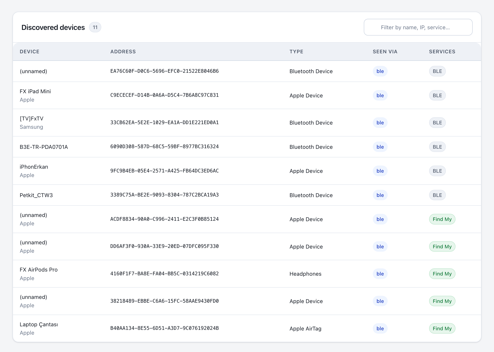
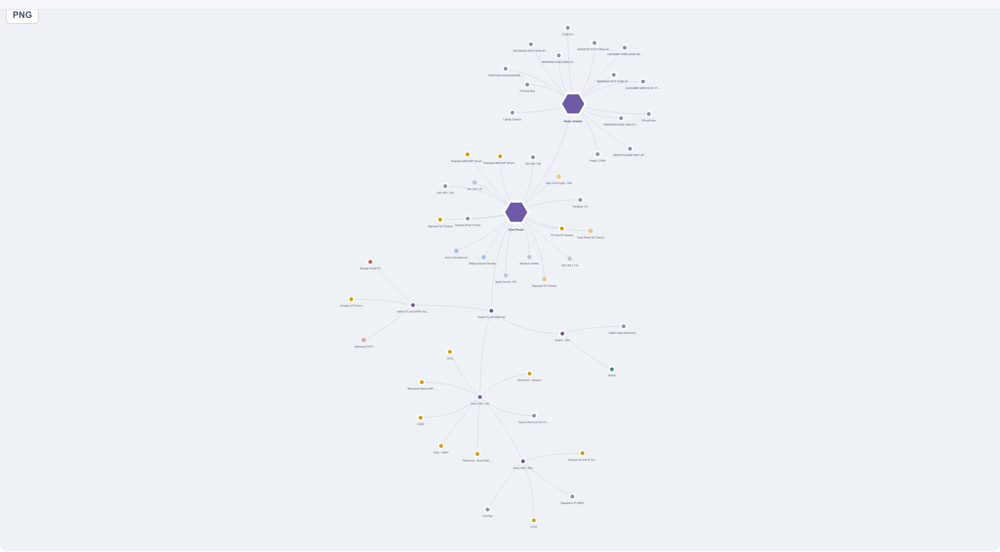
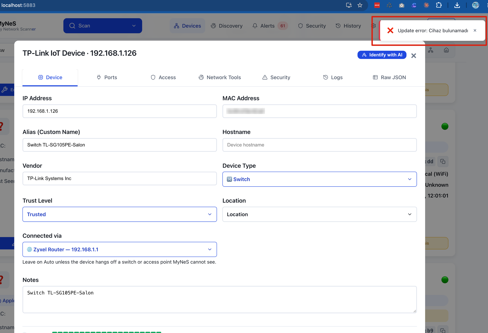
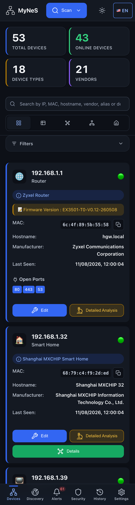
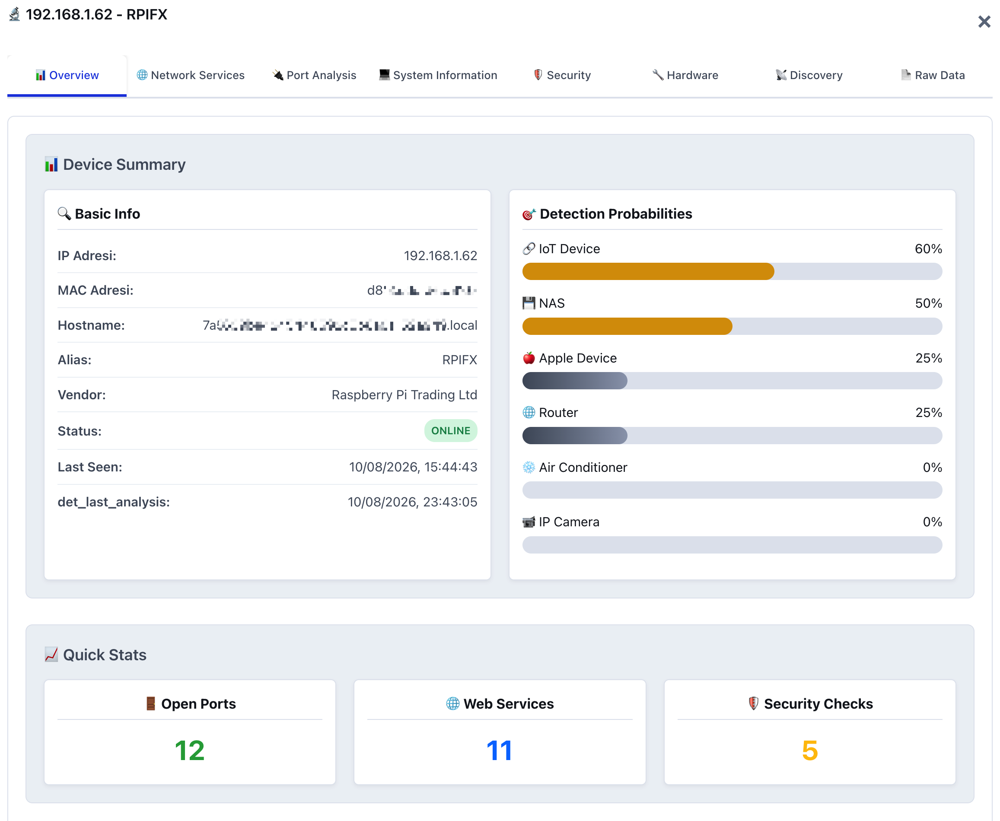
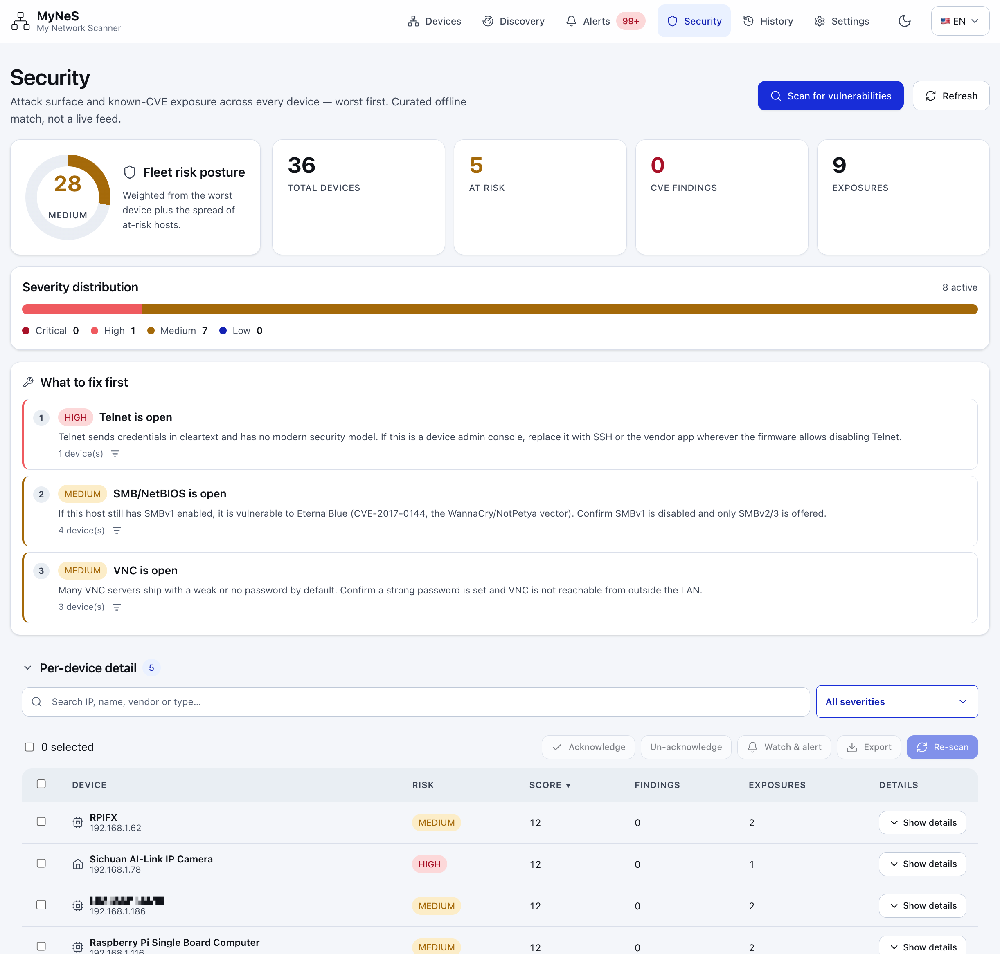

# Changelog

All notable changes to MyNeS (My Network Scanner) are documented here.
Format loosely follows [Keep a Changelog](https://keepachangelog.com/1.1.0/);
versioning follows [SemVer](https://semver.org/).

## [Unreleased]

## [1.8.1] — 2026-08-17

Three data-integrity fixes after a live install lost a day of device edits. The
device store (`lan_devices.json`) could be silently shrunk to a handful of
devices by a degraded scan or a bad load, taking every alias, note and custom
type with it — and nothing kept a copy. Now **every save snapshots the previous
store first** (rotating backups, always taken right before the store shrinks),
so a bad scan is one file-copy away from undone instead of gone. The scanner
also stops stamping its **own container name onto the host** it runs on, and the
graph view no longer draws a host's **Docker bridge networks as peer LANs**
chained to each other.

### Fixed

- **The device store can no longer be silently wiped.** `save_to_json()` now
  rotates a backup of `lan_devices.json` into `data/backups/` before every
  overwrite — deduped to one an hour, but **always** taken when the write would
  drop devices, and it logs the shrink loudly. A degraded scan (lost ARP
  privilege, a failed load) used to overwrite 29 devices with 2 and there was no
  way back; the pre-shrink copy is now always on disk.
- **The host is no longer renamed after the container.** Under host networking
  `socket.gethostname()` returns the *container* name (`mynes`), which was
  stamped onto the host device as `mynes (Ethernet)` and overwrote the user's
  alias every scan. MyNeS now reads the real host name from the Docker socket
  (`docker info` → `Name`) and, failing that, leaves the name blank for
  vendor/smart-naming — so the name you set sticks.
- **Docker bridge networks group under their host in the graph.** Each of a
  host's Docker networks was drawn as a separate top-level subnet, and all
  subnet hubs were ring-linked so unrelated bridges looked connected to each
  other and to the LAN. Docker-network hubs now hang off the machine that runs
  them; only real subnets still ring together.

## [1.8.0] — 2026-08-17

MyNeS now reads Apple's **Find My** advertisements — the ones Apple keeps closed
to other apps — so AirTags, AirPods and nearby iPhones/iPads/Macs finally show
up with the right name and type instead of a nameless "Bluetooth Device". A BLE
scan already caught some of these, but mislabelled every Find My blip as an
"AirTag"; now the advertisement's status byte is decoded properly to tell an
AirTag from AirPods, from a licensed third-party tracker, from a plain Apple
device — along with its battery level and whether it is with its owner or
separated. It is all read passively from the public advertisement: no Apple ID,
no cloud, nothing leaves the LAN.

### Added

- **Apple Find My device detection.** BLE discovery now decodes Apple's
  offline-finding (`0x12`) advertisement: AirTag / AirPods / third-party Find My
  accessory / generic Apple device from the status byte, plus a **battery
  bucket** (Full → Very Low) and **separated-vs-nearby** state, surfaced as a
  `Find My` service and `find_my` / `battery` attributes.
- **AirPods & Beats models.** The `0x07` proximity-pairing advertisement is
  parsed for a model name — AirPods Pro, AirPods Max, Powerbeats Pro, Beats Fit
  Pro and more — used as the device name when it advertises none.
- **Nearby Apple devices.** Continuity advertisements (`0x10` and friends) from
  iPhones, iPads, Macs and Watches are now labelled **Apple Device** instead of
  a generic Bluetooth blip.

### Fixed

- BLE discovery no longer calls **every** Apple Find My advertisement an
  "AirTag" — a generic Find My device with an unset class now reads as an Apple
  device, and iPhones/iPads seen over Continuity are no longer dropped to
  "Bluetooth Device".

## [1.7.0] — 2026-08-17

The graph view is rebuilt on [vis-network](https://visjs.github.io/vis-network/)
— an interactive, physics-driven canvas that replaces the old hand-drawn SVG
where nodes and their labels piled on top of one another. You can now drag nodes
wherever you want, switch between force / hierarchy / radial layouts, choose how
many levels deep the tree branches, and colour every device by its type. Click a
device to trace its full path to the router (and light up everything hanging off
it); double-click to open its edit sheet. The library is vendored locally, so it
still works on a LAN with no internet.

### Added

- **Interactive network graph.** The graph view now runs on vis-network:
  animated force layout that spreads nodes out (no more overlapping dots and
  labels), draggable nodes with a **physics freeze** toggle so a hand-arranged
  layout stays put, and three layouts — **Force**, **Hierarchy** and **Radial**
  — chosen from the toolbar and remembered per browser.
- **Branch-depth control.** A **Levels** picker (1–4 or All) limits how many
  hops out from the routers the graph draws, for reading a large LAN one tier at
  a time.
- **Path highlighting.** Selecting a node keeps it, its direct neighbours and
  its whole uplink chain to the router in full colour — e.g. an access point →
  its switch → the gateway — while everything else dims but stays legible.
  Selecting an edge highlights the same for its endpoints.
- **Hover detail card and double-click to edit.** Hovering a node shows the same
  IP / MAC / type / vendor / Docker card the topology view uses; double-clicking
  opens the device edit sheet.

### Fixed

- **Graph nodes and labels no longer collide.** The old fixed-tick SVG layout
  let dots and captions stack unreadably on a busy network; the physics layout
  keeps them apart.
- **Dark-theme graph labels are readable.** Label halos matched the wrong
  surface colour and drew a bright rim around every caption in dark mode; they
  now blend into the canvas background in both themes.

## [1.6.2] — 2026-08-17

Editing a device while a scan was running silently failed — Location, Trust
Level and "Connected via" changes never saved, the device card never refreshed,
and the topology diagram showed every device hanging off the main router instead
of its assigned switch/access point. The scan had emptied the in-memory device
list for its whole duration, so the edit landed on nothing.

### Fixed

- **Device edits no longer fail during a scan.** `scan_network` cleared the
  device list at the start of a sweep and only rebuilt it at the end; any
  `/update_device` in that window returned "device not found" (404), so the
  edit — and the "Connected via" uplink save nested behind it — was dropped.
  The scan now builds into a local list and publishes it atomically, keeping
  the previous complete list live and editable throughout. An edit that lands
  mid-scan is carried over so the finishing scan can't revert it.

## [1.6.1] — 2026-08-17

Mobile pass: every page was opened at a phone viewport (390px, touch) and each
tab, text box, dropdown and button exercised. Several pages that rendered fine on
a desktop were unusable on a phone — the Logs viewer wrapped one character per
line, the alert-history filters ran off the right edge — and are now fixed.
Editing a device that has no MAC (an iPhone with a private address) no longer
errors out.

### Fixed

- **Editing an iPhone (or any MAC-less device) no longer fails** with
  `'NoneType' object has no attribute 'lower'`. The device edit form sends
  `mac: null`; the update path now guards it and, as a bonus, refuses to let a
  blank IP/MAC in the payload wipe the real one.
- **Logs tab is readable on a phone.** The fixed time/level/logger columns left
  the message almost no width, so it wrapped one character per line; the message
  now takes its own full-width row below the metadata.
- **Alert-history filters stay on-screen.** The header packed a search box, two
  filter dropdowns and two buttons into one non-wrapping row, pushing a dropdown
  entirely off the right edge; control-heavy card headers now wrap on mobile.
- **Detection-rule patterns are legible.** The device-type dropdown squeezed the
  pattern text to a few pixels; the pattern now gets its own full-width line.
- **Discovery → System setup rows** no longer wrap one word per line — the
  description takes a full row and the status badge/action move below it.
- **Header language switcher** no longer spills ~7px past the viewport on the
  crowded Devices header (its decorative caret is dropped at phone width).

### Changed

- **Port scanning no longer depends on nmap.** `scan_ports_enhanced` uses the
  same stdlib connect-scan as the fast path, so SMB/NetBIOS, VNC, Telnet and
  RTSP are always probed (the Security page's exposures now show up) and a
  missing nmap can no longer silently return zero ports.
- **Hostnames resolve via the LAN gateway.** A PTR query is sent straight at the
  router, which serves a name for every DHCP lease — naming devices even where
  the system resolver can't (a Docker container, a macOS host not pointed at the
  router).

## [1.6.0] — 2026-08-13

Container-install parity: the same install run as a Docker container (Raspberry
Pi / CasaOS) now identifies, labels, filters and secures devices exactly like
the local Python run, and the two long settings pages that grew unwieldy are now
compact, searchable tables.

### Added

- **Config self-seeds into mounted volumes.** A container bind-mounts `config/`,
  which shadows the files baked into every image, so anything added after a
  host's config dir was first created never arrived — an empty emoji picker, a
  stale `device_types.json`. `paths.seed_config_defaults()` now copies any
  *missing* reference file from a never-mounted `/app/config_defaults` on
  startup: copy-if-missing only, never overwriting user data, never seeding
  per-install secrets, so a container update can no longer wipe anything.
- **Four new device-list filters** — **Location**, **Connected via** (the
  topology uplink parent, so you can group everything behind one switch/AP),
  **Network Type** (WiFi / Wired / Radio), and **Network** (subnet) — as the
  same searchable dropdowns, laid out as two rows of five.
- **Random-MAC show/hide filter.** Rotating privacy MACs (locally-administered
  addresses) each look like a brand-new one-hit-wonder device; a shared toggle
  hides them.
- **Docker settings page, rebuilt.** Renamed to **Docker** with a container
  icon, a compact status strip, and **Networks / Containers / Scan Ranges** as
  searchable, sortable tables behind sub-tabs — instead of one long scroll of
  cards.
- **History → Device availability** gains a Device Type filter, **sort by
  availability %**, and **pagination** (60/page), so a network full of BLE and
  rotating-MAC devices no longer renders hundreds of rows.
- New device types: **Single Board Computer**, **Docker Container**, **Docker
  Network**, **Container**.

### Changed

- **Device-type icons self-heal.** Built-in types are merged from defaults on
  every load and legacy mono glyphs are repaired (Server `🖧` → `🖥️`), so a
  stale mounted `device_types.json` catches up instead of rendering `?`.
- **Docker devices read cleanly.** Bridge gateways are labelled `Docker: <network>`
  (type **Docker Network**) instead of `<host> (docker: …)`, and containers in
  Docker's `02:42:` MAC range are identified as **Docker Container** (vendor
  Docker) rather than Unknown. A one-time migration fixes existing records.
- **Security is now independent of the network scan.** The Security page
  re-assesses in place (no `/scan`), so it no longer hijacks the Devices page,
  and docker-internal addresses are excluded from the attack surface — no more
  the host's SMB/VNC reported once per bridge. CVE ids in the advice link to
  CVE.org.
- **OUI download is idempotent** and reports the real new/changed counts instead
  of "39923 entries processed" on every click.

### Fixed

- Selecting any filter no longer wipes the whole device list (a render error
  used to leave it pinned to an empty subset).
- Unchecking **Containers** now hides container instances too, not just bridges.
- Every filter dropdown shows a distinct **All** / clear row.
- The redundant IP filter on History availability was removed (the No-IP toggle
  already does it).
- The image no longer bakes per-install secrets from `config/` (added a
  `.dockerignore`).

## [1.5.0] — 2026-08-11

### Added

- **Identify any device with AI.** A new **Identify with AI** action on the
  device Details modal asks a hosted LLM (Anthropic / OpenAI / OpenRouter,
  provider + key set in Settings) what a device most likely is from the signals
  MyNeS already gathered — vendor, OUI, hostname, open ports, banners — and
  returns a device type with a **confidence KPI**, selectable candidate types
  that always map to a valid MyNeS Device Type, and alternatives instead of
  over-committing to one guess. The run shows a live working state (spinner +
  elapsed seconds) and its result is saved onto the device. `analysis/ai_identify.py`
  is self-contained and optional; without a key the button simply isn't offered.
- **Table view for the device list** (`table-view.js`): sortable columns, a
  column picker, row selection with an accent bar, and bulk actions (change
  type / trust / location) alongside the existing card and grouped views.
- **Device trust levels, location and Wake-on-LAN.** The edit modal gains a
  trust level (Known / Unknown / Trusted) with its own filter and a card badge,
  a free-text Location/room shown on the card, a Delete Device button, and a
  Wake-on-LAN sender in the Tools tab (stdlib magic packet, no new dependency).
- **Persistent, daily-rotated logs with a day picker.** Logs now survive a
  restart (`TimedRotatingFileHandler`, midnight rotation, 30-day retention):
  today streams from the live ring, past days are read back from disk. Records
  carry a source location (`module.func:line`) and exceptions their traceback,
  both surfaced in the Settings → Logs viewer.
- **Searchable dropdowns app-wide.** Every `<select>` auto-enhances into the
  app's searchable dropdown (opt out with `data-native`), a MutationObserver
  catches dynamically-rendered ones, and `data-allow-custom` lets a typed value
  become a new option — so Location and similar fields accept free text.
- **Richer device Details modal.** Overview / Network Services / Ports / System /
  Hardware / Security / Discovery tabs are now derived from the normal-scan and
  AI data, so they aren't empty without a full deep scan; Raw Data is
  syntax-highlighted with a download button.

### Changed

- **One button drives the scan** — the header **Scan** becomes a red **Stop
  Scan** mid-run and blocks a second scan. Progress steps now carry structured
  stage / ip / scanned / total, so the frontend renders them in the selected
  language instead of hardcoded Turkish. Scan Settings gains a **network
  interface selector** bound to the raw-ARP sweep (multi-homed hosts pick Wi-Fi
  vs Ethernet).
- **SNMP migrated to pysnmp 7.x** (async-only API), wrapped in a small sync
  `snmp_get()` helper; the `analysis` extra now requires `pysnmp>=7.0`.
- **All console / log output is English-only**, matching the repo's
  English-comments convention (UI strings via `_()` are untouched).
- **Web-services cards surface captured HTTP headers**, with a shield mark on
  security headers, so a reachable service is never rendered blank.

### Fixed

- **Graph view honours uplink parents.** A device behind a switch (e.g. a Google
  TV off a TP-Link switch) no longer looks directly attached to the router —
  `buildGraphModel` reads each device's uplink parent from `/api/topology`,
  matching the topology diagram. The topology stage also fills the viewport
  height instead of a capped aspect-ratio box.
- **Security assessment no longer leaks exceptions to the client** — it logs the
  traceback server-side and returns a generic error. Null `Docker IPAM.Config`
  is guarded so container-network detection can't crash a scan.
- An AC Wi-Fi adapter in setup mode is now classified from its captive-portal
  banner, which the module OUI alone never reveals.

## [1.4.4] — 2026-08-11

### Fixed

- **Enhanced-analysis results now persist**, so the green **Details** button
  reliably appears after a Detailed Analysis. The analysis ran for minutes while
  holding a device reference; a scan that rebuilt the device list in the meantime
  orphaned it, so the write never reached disk. `apply_enhanced_analysis()` now
  re-locates the *live* device (mac@ip → mac → ip) and writes + saves atomically
  under a lock, and every rescan restores enhanced data by MAC so the dual-homed
  IP/MAC flap can't drop it.
- **The device card auto-refreshes when analysis completes** — no page reload or
  app restart. `refreshDevicesAfterAnalysis()` runs immediately on completion,
  independent of the (possibly minimized/closed) modal: a full list refresh, then
  a `/device/<ip>` fallback that injects the enhanced payload and re-renders, with
  one retry.
- **Completion is now actually signalled.** A `ReferenceError`
  (`currentAnalysisIP is not defined`) had been aborting the completion handler,
  so there was no toast, no results, no button. The analysis toaster now turns
  green on success / red on error, a completion notification fires, and a failed
  analysis is surfaced instead of silently swallowed.
- **IP/MAC "changed" alert spam** for a dual-homed host (a Pi with Ethernet and
  Wi-Fi on the same L2, whose IP↔MAC mapping flaps every scan) is suppressed by
  a self-learning known-pairs memory: the first sighting of a new pairing alerts,
  repeats stay quiet, and a genuinely new IP/MAC still fires. No device, IP or
  MAC is hardcoded.

### Changed

- **Port scan reports the range it is on.** The scan runs range by range as
  separate nmap calls (`fast` = 1–1024, `common` = 1–10000, `full` = all 65535),
  so the live log advances (`scanning 5001-10000…`) instead of freezing on one
  message for minutes. The redundant per-poll "Port tarama devam ediyor" log spam
  was removed, and finishing an analysis locks the Start button to prevent an
  accidental re-run.

## [1.4.3] — 2026-08-10

### Added

- **Searchable, sorted dropdowns app-wide.** A single-select searchable control
  (`MynesFilters.enhanceSelect`, styled like the filter panel's multi-selects)
  now backs the device-edit Device Type / Connected via fields and, via a
  `data-searchable` attribute, the Alias/Open Ports, history, alerts (muted
  device / rule), and security severity dropdowns. Native `<select>`s stay as
  the value holder, so every save/read path is unchanged.
- **Device edit "Logs" tab** plus a live status footer on the Device tab: an
  online/offline traffic light, the last ~20 availability checks as green/red
  cells, and scan facts — assembled from the uptime series and alert history,
  no new logging. The Logs tab holds the per-device activity timeline.
- **More device types** registered and translated: Bluetooth Device/Tracker,
  Headphones, Wearable, Sensor, Beacon, Zigbee Device, Z-Wave Device, Apple
  AirTag, Samsung SmartTag, Tile Tracker (plus Air Purifier). The BLE
  classifier now emits the specific tracker types instead of a generic bucket.

### Changed

- **Home Assistant credentials use a single canonical name**, `HA_URL` /
  `HA_TOKEN`, across code, docs, deploy manifests and tests (the `MYNES_HA_*`
  alias is dropped). A 401/403 now says to check `HA_TOKEN`, and the
  device-compare table adapts its columns to whichever HA source answered.
- **Device Types settings** redesigned: the add form is a compact top row that
  persists immediately, and the current-types grid uses the full width (4-up).
  The emoji picker gains a populated Computer category and larger, hover-zoom
  icons.
- **Device availability** lists the IP first (leftmost), aligned and IP-sorted.
- **Security per-device** puts search and the risk filter on one row, colour-
  codes the severity options, and expands a row when its name/IP is clicked.
- Templates reload without a restart (`TEMPLATES_AUTO_RELOAD`).

### Fixed

- Edit-page dropdowns no longer render a doubled frame/chevron, and device
  cards no longer show a stray line above the status dot — both were CSS class
  collisions (`ds-select`, `device-status`) with pre-existing styles.
- "Connected via" now lists every candidate device (options nested in
  `<optgroup>` were being skipped).
- Dropdown popovers render above sticky table headers (z-index), and the Device
  Management modal's Add/Manage tabs sit on one row.

## [1.4.2] — 2026-08-10

First tagged release since 1.4.0. 1.4.1 shipped in git but was never tagged or
published, so its changes are folded in here.

### Added

- **CVE risk & security dashboard** (`mynes/security/cve.py`,
  `/api/security/vulnerabilities[/<ip>]`). A curated CVE-pattern table — real
  CVE IDs with banner-anchored regexes — plus port-based attack-surface
  exposures, matched against each device's already-collected fingerprint. A
  dashboard summarises exposure across the fleet. Deliberately not a live
  NVD/vulners feed: the table is offline and reviewable. Configurable CVE
  settings and an import of the official CVE List V5 back the matching.
- **Subnets & topology overlay** (`mynes/core/subnets.py`). Devices are grouped
  by the subnet they are actually in — a real interface/Docker CIDR when known,
  else the device's own /24 — and the graph gains a subnet overlay on top of the
  parent/child uplink tree.
- **Deeper device identification.** Active service fingerprinting
  (`mynes/analysis/fingerprint.py`) reads RTSP/HTTP/SSH/FTP banners and probes
  NBNS (UDP 137) for SMB/NetBIOS; OS-family and WiFi-vs-wired guessing is
  consolidated in `mynes/analysis/os_detect.py`. On-demand
  ping/traceroute/port-probe/DNS diagnostics per device
  (`mynes/core/diagnostics.py`, `/api/diagnostics/<ip>/*`).
- **UI.** Shared filters across pages, graph zoom + hover cards, container-to-host
  nesting, two-signal detection, per-device availability history, plus metrics
  and exports.
- **Bluetooth LE discovery actually works in a container.** The README, the
  add-on description and the marketplace listings have all promised "including
  the Zigbee, Z-Wave, Matter and Bluetooth LE ones an IP scan cannot find" since
  1.3.0, but `deploy/requirements-docker.txt` left `bleak` out on the grounds
  that "containers have no BLE adapter". That is true of a bridged container and
  false of the way MyNeS is actually deployed: `network_mode: host` on a box
  whose `bluetoothd` is already running. bleak does not drive the radio on
  Linux, it asks BlueZ over the D-Bus system bus — so the image needs no BlueZ
  packages, no USB passthrough and no `privileged: true`, only the bus socket
  mounted at run time. The image now ships `bleak`, and the manifests mount
  `/run/dbus/system_bus_socket`. The app still runs as the unprivileged
  `scanner` user; BlueZ's default D-Bus policy already allows it.

### Fixed

- **`ble: ok` while finding nothing.** `available()` only checked that `bleak`
  imports, which says nothing about whether the bus is reachable. A container
  without the socket therefore reported the backend as healthy with a count of
  zero — identical to a scan that legitimately found no BLE devices — and the
  underlying failure surfaced only as a logged `[Errno 2] No such file or
  directory`. The backend now checks for the system bus up front and reports the
  mount that is missing, so `/api/capabilities` and the Discovery page name the
  cause. The check tests for a *socket* rather than mere existence, because
  docker creates an empty directory at a bind mount whose source is absent,
  which would otherwise look healthy and fail later.

## [1.4.0] — 2026-08-04

Everything here came out of installing 1.3.0 from the CasaOS store onto a
Raspberry Pi and using it. None of it reproduces on a dev machine, which is
why it all shipped.

### Fixed

- **Raw ARP in a container.** `cap_add: NET_ADMIN/NET_RAW` grants nothing to a
  non-root process — the capabilities land in the bounding set and never in the
  effective one, so every container install silently fell back to a ping sweep.
  The Dockerfile now `setcap`s the interpreter, which survives the drop to the
  `scanner` user, and the entrypoint starts as root only long enough to hand
  over the docker socket's group before `exec gosu scanner`.
- **Docker integration never connected** (`mynes/integrations/docker.py`), three
  independent bugs stacked: the socket path was assigned *after* the probe that
  reads it, so the `AttributeError` was swallowed as "Docker is not installed";
  the socket client asked `requests` for `http+unix://`, which it cannot do
  without `requests-unixsocket`; and container detection read `/proc/1/cgroup`,
  which says `0::/` under cgroup v2 whether you are in a container or not. The
  Engine API now goes over `http.client` on an `AF_UNIX` socket — stdlib only —
  and the manifests mount the socket.
- **Every docker bridge showed the same device name.** A host with a dozen
  containers has a dozen bridges, all classified `Docker`, all rendering as an
  identical `<host> (Docker)` in the list, the graph and the topology view.
  They are now labelled with the docker network behind them
  (`<host> (docker: mynes_default)`), falling back to the interface name.
- **The sign-in gate could not be turned on where it matters.** Credentials were
  environment-only and the UI said "add these to `.env` and restart" — advice
  with no meaning inside a store-installed container. Settings now takes a
  username and password directly (`POST /api/auth/credentials`) and stores a
  PBKDF2 hash in `data/security.json`, mode 600. Environment variables still
  win, and the endpoint refuses to overwrite them.
- **"Notifications: Unsupported" was a misleading diagnosis.** Browsers hide
  `serviceWorker`/`PushManager` entirely on an insecure origin, so a plain
  `http://<lan-ip>` page is indistinguishable from an ancient browser. The UI
  now names the real cause, and `MYNES_TLS=adhoc` (or `MYNES_TLS_CERT`/`_KEY`)
  serves https so push actually works. `pywebpush` is now in the image; without
  it the server half was missing regardless.
- **Installing the background service crashed inside a container**, where it
  went looking for `systemctl`. It is reported as not applicable now — the
  scheduler already runs in-process and restarts are the runtime's job.

### Notes

- Mounting `/var/run/docker.sock` is optional in every manifest. Drop the line
  and everything except the Docker panel keeps working.
- Bluetooth LE stays out of the image on purpose: a container has no adapter.

## [1.3.0] — 2026-08-04

### Added

- **MyNeS sends its own notifications** (`mynes/monitoring/push.py`). Web Push
  straight from this server to the browser or the installed PWA — no Home
  Assistant, no ntfy, no relay in the path. Allow notifications once per device
  and alerts arrive with the tab closed.
  - VAPID key pair is generated on first use into `config/.vapid_key`
    (mode 600, gitignored); subscriptions live in
    `data/push_subscriptions.json`.
  - A subscription the push service reports as gone (404/410) is pruned
    automatically — an uninstalled PWA would otherwise fail on every alert.
  - Enabling it on a device also creates the `mynes_push` channel if it is
    missing, so alerts do not silently go nowhere after granting permission.
  - Optional dependency: `pip install 'mynes[push]'` (pywebpush). Without it
    the channel reports itself unavailable and everything else keeps working.
  - Subscriptions are stored as opaque records tagged with a `kind`, so the
    Phase-2 mobile app can register an Expo/FCM token in the same table
    instead of needing a second one.
  - New endpoints: `GET /api/push/key`, `GET /api/push/subscriptions`,
    `POST /api/push/subscribe`, `POST /api/push/unsubscribe`,
    `POST /api/push/test`. `/api/capabilities` reports push availability and
    the registered device count.
- **Home Assistant notify channel.** Calls a `notify.*` service directly over
  the REST API with the token already configured — unlike the webhook channel
  it needs no automation built in Home Assistant first. The channel picker
  lists the services the install actually exposes
  (`GET /api/integrations/home-assistant/notify-services`), so nobody has to
  guess `notify.mobile_app_<slug>`. Defaults to `persistent_notification`,
  which exists everywhere.

Both ride the existing rule and severity filters, so "new device found" and
"device unreachable" reach either destination with no extra configuration.

## [1.2.0] — 2026-08-04

### Added

- **Three new layouts in the device view's layout switch.**
  - *Graph* — force-directed cloud, subnet gateways drawn as hubs, device
    category by colour. No charting dependency; the layout is ~40 lines of
    spring/repulsion in `static/js/views.js`.
  - *Topology* — the real chain, `Internet → router → switch/AP → group →
    device`, with devices bucketed into 17 named groups (Lights, Cameras,
    Climates, Medias, Pets, Servers, Computers, Phones, Tablets, Access
    Points, Vacuums, Switches, Sensors, IoT Devices, TVs, Smart Home, Other).
  - *Home plan* — a floor plan with drag-and-drop device pins. Room names are
    editable, the background can be replaced with the user's own image
    (downscaled to 1600px before it is stored), and pin positions are kept as
    fractions so the plan stays correct at any width.
- **Uplink discovery** (`mynes/core/topology.py`, `/api/topology`). Answers
  "what is this device plugged into" from three sources, most-trusted first:
  a hand-assigned uplink, a traceroute-discovered routed hop, then
  assumed-direct. Known edges draw solid, assumed ones dashed. An unmanaged
  switch is invisible at layer 3, so the manual assignment is the only way to
  record one — the UI says so rather than guessing.

### Changed

- **History page** rebuilt on the design system: KPI tiles match the Devices
  page, charts carry data labels and a legend with counts and percentages,
  and the donut/trend series read their colours from shared `--chart-*`
  tokens so they work in both themes.

- **Settings page** rebuilt on the design system. Device Types is a card grid
  with legible icons instead of a cramped scroll box; detection rules show the
  device type each pattern maps to, as an editable dropdown.
- **Header and footer.** The brand is now "MyNeS" over "My Network Scanner";
  the footer carries the version, a GitHub link and the author, without the
  commit hash.
- New app icon and favicon, replacing the emoji-in-an-SVG placeholder.
- "Advanced Analysis" is called **Detailed Analysis** everywhere, and the
  action-button icons come from the sprite at a legible size.
- The version is a constant in `mynes/core/version.py` instead of a
  git-describe string; users were being shown things like `1.0.5-f5cfbb2+`.

### Fixed

- **Settings took seconds to become usable**: the 1.5 MB OUI database was
  fetched and parsed during page load, blocking every other tab. It is now
  loaded when its own tab is first opened, and the list renders at most 200
  matching rows instead of building 40,000 DOM nodes. Search filters the data
  (debounced) rather than walking every node.

- Vendor bars on the History page overflowed their card — a 510px fixed-width
  name column, now a grid.
- Trend chart labels and history dates were hardcoded Turkish and appeared
  untranslated on the English page.
- The built-in home floor plan was invisible on the light theme.
- Table headers used the inverted palette, which came out white in dark mode.
- Card action buttons sat at different heights depending on card content;
  they now align to the bottom edge.
- Turkish and English translation tables are complete and in sync (both 549
  keys); the settings page no longer has hardcoded Turkish strings.

### Removed

- The Network Map layout. The graph and topology views replace it. The
  service worker cache version was bumped so the removed button does not
  linger in an already-installed PWA shell.

## [1.1.0] — 2026-08-04

This release is built around one idea: **a home network is not just IP addresses.**
An ARP scan cannot see a Zigbee bulb, a Bluetooth tracker or a Matter sensor,
so v2 adds a discovery layer per protocol, a monitoring loop that tells you
when something changes, and a Home Assistant integration that works in both
directions.

### Added

#### Protocol discovery — beyond ARP and nmap

A new `mynes/discovery/` package, one isolated module per protocol. Every
backend reports `available() -> (bool, reason)` and a dead protocol yields an
empty list instead of breaking the scan.

| Protocol | Finds |
|---|---|
| mDNS / Bonjour (`zeroconf`) | Printers, NAS, Chromecast, HomeKit, **Matter** (`_matter._tcp` / `_matterc._udp`), Raspberry Pi |
| SSDP / UPnP (stdlib sockets, zero deps) | Routers, smart TVs, DLNA, cameras, consoles |
| ONVIF / RTSP | IP cameras, doorbells, NVRs — name, model and stream URL |
| Bluetooth LE (`bleak`) | Trackers, sensors, wearables, headphones — keyed by BT address, no IP |
| MQTT | Zigbee2MQTT, Z-Wave JS, Tasmota and HA-discovery retained topics — the only way to see radio devices |
| DHCP (passive) | Devices that announce themselves; needs raw-socket privileges |

#### Monitoring & alerts

- `monitoring/rules.py` — **pure** `(previous, current) -> [Alert]` functions,
  no I/O, so the diff logic is testable without a network.
- `monitoring/scheduler.py` — one daemon thread: scan → diff → alert → notify,
  on a configurable interval.
- Rules for: new device, device offline (after N missed scans), back online,
  IP change, new open port, weak BLE signal, under-voltage and low battery
  (Raspberry Pi / Orange Pi boards throttle below ~4.7 V).
- `monitoring/notify.py` — stdlib-only channels: generic webhook, Slack,
  Discord, ntfy, Telegram and SMTP. Adding a channel = adding one function to
  `SENDERS`.
- Capped JSON alert history with severity filter, mark-read and clear.

#### Home Assistant integration, both directions

- **Push** — MQTT Discovery publishes each device as a `device_tracker`, so
  MyNeS devices show up in HA without a custom component.
- **Pull & compare** — reads HA's **device registry over WebSocket** (not just
  `/api/states`), so Zigbee, Z-Wave, Matter, Bluetooth and Cloud devices that
  have no IP are still matched. Comparison is by normalised IP **and** MAC, so
  a device HA calls `192_168_1_79` and MyNeS calls `192.168.1.79` counts once.
- `scripts/ha_compare.py` — a token-safe CLI diff (`in_both`, HA-only,
  MyNeS-only) that never prints your token.
- Credentials read from `MYNES_HA_URL`/`MYNES_HA_TOKEN` or bare
  `HA_URL`/`HA_TOKEN`.

#### Six device views

The Devices page gained a view switcher. Card and Table were there before;
Map, **Graph**, **Topology** and **Home** are new.

**Graph view** — a force-directed map of the LAN, devices coloured by category
(Network, Servers & NAS, Personal, Media, IoT, Other) around the gateway.

**Topology diagram** — the physical shape of the network: Internet → router →
device groups. `Discover uplinks` runs a traceroute pass, and because a bridged
switch or access point is invisible on the wire, you can click a device and say
what it is plugged into. Solid lines are known uplinks, dashed are assumed
direct.

**Home view** — a floor plan. Drop a device onto a room to pin it, drag to move,
double-click to remove. Ships with a default plan and accepts your own
background image; the sidebar lists everything not yet placed, grouped by type.

#### Desktop platform integration (`mynes/platform/`)

- `privileges.py` — the narrow, permanent privilege fix per OS instead of
  "run everything as root": Linux `setcap`, macOS ChmodBPF + `access_bpf`
  group, Windows Npcap. It **prints** the commands by default and only runs
  them with `--apply`, so the password prompt appears in the user's own
  terminal. A web request can never escalate privileges.
- `service.py` — run MyNeS in the background at login via a launchd
  LaunchAgent (macOS), a `systemd --user` unit (Linux) or a Scheduled Task
  (Windows). All **user-level**: no sudo, uninstall is deleting one file.
- `tray.py` — optional menu-bar / notification-area icon (`pystray`).

#### Web app

- `static/css/design-system.css` — semantic tokens (`--bg-surface`,
  `--text-primary`, `--severity-*`) as the single source of style truth. Page
  CSS never hardcodes a colour.
- **Dark mode**, first-class alongside light. OS preference is the default;
  `[data-theme]` on `<html>` overrides it in either direction.
- **PWA** — `manifest.webmanifest` plus a network-first service worker, so the
  app installs to a phone home screen and survives a flaky Wi-Fi hop.
- **SVG icon sprite** (`templates/_icons.html`) replacing emoji as UI icons.
- **Turkish and English** UI via `web/i18n.py` and `web/locales/{tr,en}/`.
- Accessibility: visible focus rings, 44px minimum tap targets,
  `prefers-reduced-motion` respected.

  
  

- New `/api` v2 blueprint: `/api/discovery`, `/monitoring`, `/alerts`,
  `/notifications`, `/integrations`, `/health`, `/capabilities`.
- **`/api/capabilities`** exists because "it only found two devices" is a
  permissions problem, not a bug report — it reports exactly which privilege
  or dependency is missing and how to fix it.

#### Other

- `scripts/run.py` — one command on any OS: creates the venv, installs deps,
  checks for nmap, runs the app.
- Docker image published from CI; host networking documented, because that is
  what makes LAN discovery work in a container.
- Credential storage encrypted with Fernet + PBKDF2-HMAC-SHA256 (100k
  iterations); `security/sanitizer.py` strips sensitive fields before export.

Detailed per-device analysis — services, system information and security
findings behind one button:

- `docs/PHASE2_MOBILE.md` — the React Native / Expo plan and the server-side
  prerequisites (token auth, CORS, QR pairing, frozen `/api/devices`, SSE
  progress) to get right in Phase 1.

### Changed

- **Restructured into a `mynes/` package** — `core`, `discovery`, `analysis`,
  `integrations`, `monitoring`, `platform`, `security`, `web`. This is a
  breaking change to import paths and file locations.
- Paths resolve from the package, not the current directory, with
  `MYNES_HOME` / `MYNES_CONFIG_DIR` / `MYNES_DATA_DIR` overrides — so the app
  behaves the same whether launched from a shell, a service or Docker.
- `.env` in the repo root is loaded by `mynes/__init__.py`, so every entry
  point picks it up. Real environment variables always win over the file.
- Every non-trivial module carries a runnable `demo()` with asserts, wired
  into `tests/` by a one-line test.
- README install and structure sections rewritten for v2.

### Fixed

- **Scanning without root returned almost nothing.** Raw ARP (`scapy.srp`)
  needs root; the failure was swallowed and produced an empty list —
  **2 devices reported where 29 existed.** There is now an explicit ping sweep
  + OS ARP cache fallback, and the chosen method is surfaced through
  `scanner.last_arp_method` and `scanner.privilege_hint`. A permission failure
  is never silent again.
- **The monitor announced the entire network as new devices.** With no stored
  baseline the first scheduled scan diffed against nothing and fired 49 "new
  device" alerts. The baseline is now seeded from the current device list on
  first run.
- Bluetooth devices with CoreBluetooth MAC-shaped UUIDs no longer generate a
  fresh "new device" alert on every scan.
- HA comparison counted the same device twice when HA and MyNeS spelled its
  identifier differently.
- `service.py` launches `sys.executable`, **not** `os.path.realpath(...)` —
  resolving a venv's `bin/python` lands on the base interpreter where `mynes`
  is not installed, and the service exited 1 on every start.
- `launchctl list` exits 0 for a job that is loaded but dead, and `unload`
  returns before the child is gone. Status is now read from the PID field and
  uninstall waits for the process to actually exit — otherwise an orphan kept
  holding port 5883.
- Alert timeline shows relative time ("6m ago") instead of absolute
  timestamps.
- Vendor identification fixes: "UPnP", "EX3501-T0 ZYXEL",
  "Google TV Streamer".

### Security

- `config/config.json` is tracked in git, so secrets must never be written
  there. The master password comes from `MYNES_PASSWORD` or
  `config/.master_password` (gitignored, mode 600), auto-generated if absent.
  `tests/test_smoke.py` asserts this.

---

## [1.x] — before 2026-08-03

Flat-layout Flask app: ARP + nmap scanning, device identification from an OUI
database, card and table views, JSON persistence and a config page. See the
tags `v1.0.3` … `v1.0.5`.
