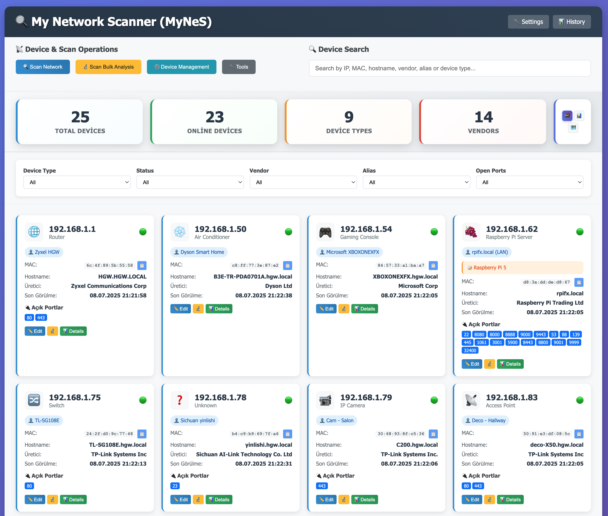

# 🌐 My Network Scanner (MyNeS)

**Beni Oku (Türkçe)** | [**Readme (English)**](README_ENG.md)

**My Network Scanner (MyNeS)**, "***Ailenizin Kullanıcı Dostu Ağ Tarayıcısı***" mottosu ile geliştirilmiş, yerel ağınızdaki tüm cihazları (Router/Modem, Laptop, Tablet, Desktop, Server, IP Camera, Gaming Console, Smart Home Appliances, .....) tarayıp, tespit ettiği cihazlar ile ilgili detaylı bilgileri kullanıcı dostu ve kolay bir arayüz üzerinden kolaylıkla yönetebilmenizi sağlayan profesyonel bir uygulamadır.

Modern ve kullanıcı dostu web arayüzü ile ağ yönetimini kolaylaştırır. Gelişmiş ve detaylı tarama, AI destekli cihaz tanıma ve güvenlik özellikleri sunar.



> *Bu uygulama tümüyle **AI destekli** olarak (**Agentic Mode**) [Claude Code](https://www.anthropic.com/claude-code)*, [Github Copilot](https://github.com/features/copilot) ve *[Visual Studio Code](https://code.visualstudio.com/) kullanılarak **Open-Source** olarak geliştirilmiştir.*

## ✨ Özellikler

- 🌐 **Web-based Interface** - Modern, kullanıcı dostu Web tabanlı arayüz
- **🔍 Otomatik Ağ Keşfi**: Yerel ağ aralığını otomatik olarak belirler
- **🔬 ARP Taraması**: Hızlı cihaz keşfi için ARP protokolü kullanır
- **🔌 Gelişmiş Port Taraması**: 1000+ port ile kapsamlı servis tespiti
- **🖥️ Cihaz Tipi Tespiti**: Router, bilgisayar, telefon, kamera vb. otomatik tespit
- **🐳 Docker Entegrasyonu**: Container ve virtual network tespiti
- **🔐 Multi-Protocol Analiz**: SSH, FTP, HTTP, SNMP desteği
- **📝 Cihaz Yönetini**: Cihaz bilgilerini elle değiştirebilme, yeni bilgiler ekleyebilme
- **🎛️ Yedekleme ve Aktarım**: JSON tabanalı basit ve kolay cihaz bilgilerini yedekleme ve geri yükleme
- **📊 Geçmiş Tarama Analizi**: Geçmiş tarama sonuçlarını ve istatistiklerini takip edebilme
- 🌍 **Çoklu Dil Desteği** - Türkçe ve İngilizce dil desteği

### 📊 Detaylı Cihaz Bilgileri

- **IP Adresleri**: IPv4 adresleri
- **MAC Adresleri**: Fiziksel ağ adresleri
- **Hostname**: Cihaz isimleri
- **Üretici Bilgisi**: IEEE OUI veritabanı ve online API'ler ile gelişmiş vendor tespiti
- **Açık Portlar**: Aktif servisler ve port numaraları
- **Cihaz Tipi**: Otomatik cihaz kategorilendirmesi
- **Sistem Bilgileri**: İşletim sistemi, donanım özellikleri
- **Güvenlik Analizi**: Zafiyetler ve güvenlik durumu
- **Docker Bilgileri**: Container durumu ve network mapping

### 🏭 Gelişmiş OUI/Vendor Yönetimi

- **Multi-Source IEEE Desteği**: OUI, MA-M, OUI-36, IAB, CID kayıtlarını destekler
- **Otomatik Güncellemeler**: IEEE kaynaklarından güncel veritabanı indirme
- **Online API Fallback**: Bilinmeyen MAC'ler için otomatik online arama
- **37,000+ Üretici Kaydı**: Kapsamlı vendor veritabanı
- **Akıllı Vendor Temizleme**: Organizasyon isimlerini normalize etme

### 🎯 AI Destekli Akıllı Cihaz Tanıma

Uygulama aşağıdaki bilgileri kullanarak cihaz tipini otomatik olarak belirler:

- **Hostname Analizi**: Cihaz isimlerinden pattern tanıma
- **Üretici Firma Bilgisi**: Vendor tabanlı sınıflandırma
- **Açık Port Analizi**: Servis tabanlı tespit
- **Bilinen Cihaz İmzaları**: Makine öğrenmesi ile güven skorları
- **Akıllı İsimlendirme**: Otomatik alias ve isim üretimi
- **Kategori Sınıflandırması**: IoT, Sunucu, Router vb. kategoriler

### 🔐 Güvenlik Özellikleri

- **Şifreli Credential Depolama**: Fernet simetrik şifreleme
- **Çok Protokol Desteği**: SSH, FTP, HTTP, SNMP credential'ları
- **Güvenli Dosya İzinleri**: Gizli dosyalar için kısıtlı erişim
- **Hassas Veri Temizleme**: Export sırasında otomatik temizleme

### 🐳 Docker Entegrasyonu

- **Container Tespiti**: Çalışan Docker container'ları bulma
- **Network Mapping**: Docker network'leri ve IP atamaları
- **Virtual Interface**: Docker sanal arayüzleri tespiti
- **Container Detayları**: Metadata ve yapılandırma bilgileri

## 🚀 Hızlı Başlangıç - Docker

[](https://hub.docker.com/r/fxerkan/my_network_scanner)
[](https://hub.docker.com/r/fxerkan/my_network_scanner)

Bu container imajı  `amd64` ve `arm64` mimarilerinin tümünü destekler.

### 🐳 Docker Compose (Tavsiye Edilen)

```yaml
services:
  my-network-scanner:
    image: fxerkan/my_network_scanner:latest
    container_name: my-network-scanner
    ports:
      - "5883:5883"
    volumes:
      - ./data:/app/data
      - ./config:/app/config
    environment:
      - FLASK_ENV=production
      - LAN_SCANNER_PASSWORD=your-secure-password
    restart: unless-stopped
    cap_add:
      - NET_ADMIN
      - NET_RAW
    privileged: true
```

### 🐳 Docker Run

```bash
# Pull and run the container
docker run -d \
  --name my-network-scanner \
  --privileged \
  --cap-add=NET_ADMIN \
  --cap-add=NET_RAW \
  -p 5883:5883 \
  -v $(pwd)/data:/app/data \
  -v $(pwd)/config:/app/config \
  -e LAN_SCANNER_PASSWORD=your-secure-password \
  fxerkan/my_network_scanner:latest

# Access the application
open http://localhost:5883
```

## 🛠️ Geliştirme

- Python 3.7+
- Nmap (sistem seviyesinde kurulu olmalı)
- Root/Administrator yetkileri (port taraması için)
- Docker (opsiyonel - container tespiti için)
- SSH/FTP/SNMP araçları (gelişmiş analiz için)

### 1. Nmap Kurulumu

**macOS:**

```bash
brew install nmap
```

**Ubuntu/Debian:**

```bash
sudo apt-get update
sudo apt-get install nmap
```

**CentOS/RHEL:**

```bash
sudo yum install nmap
```

### 2. Kodlama

1. **Kodu klonla:**

```bash
git clone https://github.com/fxerkan/my_network_scanner.git
cd my_network_scanner
```

2. **Sanal Ortam oluşturun**
3. ```bash
   python -m venv .venv

   source .venv/bin/activate
   ```
4. **Bağımlılıkları yükleyin:**

```bash
pip install -r requirements.txt
```

3. **Uygulamayı çalıştırın:**

```bash
python app.py
# or use the startup script
./start.sh
```

4. **Web arayüzü erişimi:**
   `http://localhost:5883` adresinden uygulama arayüzüne erişebilirsiniz.

### Hızlı Komutlar

```bash
# Standart Ağ taraması başlatmak için (CLI)
python lan_scanner.py
```

### Konfigürasyon

```bash
# Ana şifreyi Ortam değişki olarak atamak için
export LAN_SCANNER_PASSWORD="your_master_password"

# Flask uygulama ayarları
export FLASK_SECRET_KEY="your_secret_key"
```

## 📁 Dosya Yapısı

```
lan_scanner/
├── app.py                      # Flask web uygulaması
├── lan_scanner.py              # Ana tarama modülü
├── enhanced_device_analyzer.py # Gelişmiş cihaz analizi
├── smart_device_identifier.py  # AI destekli cihaz tanıma
├── unified_device_model.py     # Birleşik veri modeli
├── credential_manager.py       # Güvenli credential yönetimi
├── docker_manager.py           # Docker container tespiti
├── version.py                  # Dinamik versiyon yönetimi
├── data_sanitizer.py           # Güvenli veri temizleme
├── oui_manager.py              # OUI veritabanı yönetimi
├── config.py                   # Yapılandırma yönetimi
├── requirements.txt            # Python bağımlılıkları
├── config/
│   ├── config.json            # Ana yapılandırma
│   ├── device_types.json      # Cihaz tipi tanımları
│   ├── oui_database.json      # OUI veritabanı
│   ├── .salt                  # Şifreleme salt'ı (gizli)
│   └── .key_info              # Anahtar türetme bilgisi (gizli)
├── data/
│   ├── lan_devices.json       # Cihaz verileri (birleşik model)
│   └── scan_history.json      # Tarama geçmişi
├── locales/<language_code>/
│   ├── translations.json        # Dil bazlı çeviri tanımları
│   └── device_types.json        # dillere göre cihaz tipi tanımları
├── templates/
│   └── index.html             # Web arayüzü template
├── static/                    # CSS/JS dosyaları
└── README.md                  # Bu dosya
```

## 🛡️ Güvenlik Notları

- **Root Yetkileri**: Port taraması için yönetici yetkileri gerekebilir
- **Güvenlik Duvarı**: Bazı güvenlik duvarları taramayı engelleyebilir
- **Etik Kullanım**: Sadece kendi ağınızı tarayın
- **Performans**: Büyük ağlarda tarama uzun sürebilir
- **Credential Güvenliği**: Tüm giriş bilgileri AES-256 ile şifrelenir
- **Veri Temizleme**: Export sırasında hassas veriler otomatik temizlenir
- **Güvenli Erişim**: SSH anahtar tabanlı kimlik doğrulama önerilir

## 🐛 Sorun Giderme

### Yaygın Sorunlar

#### "Permission denied" Hatası

```bash
sudo python app.py
```

#### Nmap Bulunamadı

Nmap'in sistem PATH'inde olduğundan emin olun:

```bash
nmap --version
```

#### Port Tarama Çalışmıyor

- Güvenlik duvarı ayarlarını kontrol edin
- Yönetici yetkileri ile çalıştırın
- Antivirüs yazılımını geçici olarak devre dışı bırakın

#### Web Arayüzüne Erişim Problemi

- Port `5883`'ün kullanımda olmadığından emin olun
- Güvenlik duvarı kurallarını kontrol edin
- `http://127.0.0.1:5883` adresini deneyin

#### Master Password Sorunları

- Çevre değişkeni doğru ayarlandı mı kontrol edin
- Salt dosyalarının (.salt, .key_info) var olduğundan emin olun
- Dosya izinlerini kontrol edin (600 olmalı)

#### Docker Tespiti Çalışmıyor

- Docker servisinin çalıştığını kontrol edin: `docker info`
- Kullanıcının Docker grubunda olduğundan emin olun
- Docker socket'inin erişilebilir olduğunu kontrol edin

#### Credential Şifreleme Hatası

- Master password doğru girildiğinden emin olun
- Config dizininin yazılabilir olduğunu kontrol edin
- Encryption key dosyalarını silin ve yeniden oluşturun

## 🔄 Güncelleme Geçmişi

### v1.0.1 (2025-07-09)

- ✅ AI destekli cihaz tanıma sistemi
- ✅ Gelişmiş cihaz analizi (SSH, FTP, HTTP, SNMP)
- ✅ Güvenli credential yönetimi (AES-256 şifreleme)
- ✅ Docker container tespiti ve network mapping
- ✅ Birleşik veri modeli ve tutarlılık
- ✅ Veri temizleme ve güvenlik özellikleri
- ✅ Dinamik versiyon yönetimi
- ✅ 1000+ port ile kapsamlı tarama
- ✅ Güvenlik analizi ve zafiyet tespiti
- ✅ Raspberry Pi özel tespiti

### v1.0.0 (2025-07-02)

- ✅ İlk sürüm
- ✅ ARP ve port taraması
- ✅ Web arayüzü
- ✅ Cihaz tipı tespiti
- ✅ JSON veri depolama
- ✅ Import/Export özelliği

## 📄 Lisans

Bu proje MIT lisansı altında lisanslanmıştır.

## 🔗 Linkler

- **GitHub Repository**: [https://github.com/fxerkan/my_network_scanner](https://github.com/fxerkan/my_network_scanner)
- **Documentation**: [CLAUDE.md](CLAUDE.md)
- **Turkish README**: [README.md](README.md)

## 🙏 Teşekkürler

- **[Claude Code](https://www.anthropic.com/claude-code)**: AI-assisted development
- **[GitHub Copilot](https://github.com/features/copilot)**: Code assistance
- **[IEEE](https://www.ieee.org/)**: OUI database
- **[Nmap](https://nmap.org/)**: Network scanning engine
- **[Flask](https://flask.palletsprojects.com/en/stable/)**: Web framework
- **[Python](https://www.python.org/)**: Libraries and tools

---

**[fxerkan](https://github.com/fxerkan) tarafında sevgi ve yapay zekas desteği ile geliştirilmiştir - Made with ❤️ & 🤖 by [fxerkan](https://github.com/fxerkan)**

**Not**: Bu araç sadece eğitim amacıyla ve sadece kendi ağınızdaki cihazlar hakkında bilgi sahibi olmak amacıyla kullanılmalıdır.

Başkalarının ağlarını izinsiz taramak yasalara aykırıdır, My Network Scanner (MyNeS) bu tip kullanımları önermez ve desteklemez.
