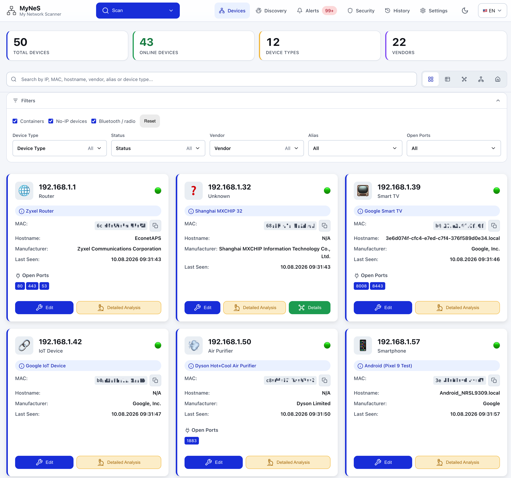

# 🌐 My Network Scanner (MyNeS)

[**Beni Oku (Türkçe)**](README.md) | **Readme (English)**

**My Network Scanner (MyNeS)**, developed with the motto "***Your Family's User-Friendly Network Scanner***", is a professional application that scans all devices in your local network (Router/Modem, Laptop, Tablet, Desktop, Server, IP Camera, Gaming Console, Smart Home Appliances, etc.), collects detailed information about detected devices, and allows you to manage your devices through a user-friendly and easy interface.

It simplifies network management with a modern and user-friendly web interface. It offers advanced and detailed scanning, AI-powered device identification, and security features.



> *This application has been developed entirely **AI-assisted** (**Agentic Mode**) using [Claude Code](https://www.anthropic.com/claude-code), [Github Copilot](https://github.com/features/copilot), and [Visual Studio Code](https://code.visualstudio.com/) as **Open-Source**.*

## 🆕 What's New in v1.3

**MyNeS now sends its own notifications.** On the Alerts page, *Notifications
on this device* → allow once, and alerts arrive in the browser or the installed
app even with the tab closed. Nothing sits in the path — no Home Assistant, no
ntfy, no relay. Each device registers itself.

**A direct Home Assistant notify channel.** Unlike the webhook channel it needs
no automation built in HA first: MyNeS calls `notify.mobile_app_...` straight
over the REST API with the token you already configured, and the picker lists
the services your install actually exposes.

New-device and unreachable/error alerts reach both destinations with no extra
configuration.

> Web Push needs one optional dependency: `pip install 'mynes[push]'`

## 🆕 What's New in v1.2

> Full per-release detail: [**CHANGELOG.md**](../CHANGELOG.md)

**Three new layouts** in the device view's layout switch:

| View              | What it shows                                                                                  |
| ----------------- | ---------------------------------------------------------------------------------------------- |
| **Graph**         | Force-directed cloud; subnet gateways as hubs, devices coloured by category                     |
| **Topology**      | The real chain: `Internet → router → switch/AP → group → device`, across 17 named groups     |
| **Home plan**     | Drag-and-drop device pins on a floor plan; room names are editable                              |

In the home plan you can swap the background for your own image; pin positions
are stored as fractions, so the plan stays correct at any width.

**Uplink discovery** (`/api/topology`) answers "what is this device plugged
into" from three sources, most-trusted first: a hand-assigned uplink, a
traceroute-discovered routed hop, then assumed-direct. Known edges draw solid,
assumed ones dashed. **A bridged switch or access point is invisible at layer
3** — so nothing is guessed; you click the device and say what it hangs off.

**History and Settings rebuilt on the design system** — charts carry data
labels and a legend with counts and percentages; Device Types is a card grid
with legible icons; detection rules now show which device type each regex maps
to, as an editable dropdown.

**Settings opens instantly** — the 1.5 MB OUI database was fetched and parsed
during page load, blocking every other tab. It now loads when its own tab is
first opened, and the list renders at most 200 matching rows instead of 40,000
DOM nodes.

**The Network Map view was removed** — the Graph and Topology views replace it.

## ✨ Features

- 🌐 **Web-based Interface** - Modern, responsive, user friendly web UI
- **🔍 Automatic Network Discovery**: Automatically determines local network range
- **🔬 ARP Scanning**: Uses ARP protocol for fast device discovery
- **🔌 Advanced Port Scanning**: Comprehensive service detection with 1000+ ports
- **🖥️ Device Type Detection**: Automatic detection of routers, computers, phones, cameras, etc.
- **🐳 Docker Integration**: Container and virtual network detection
- **🔐 Multi-Protocol Analysis**: SSH, FTP, HTTP, SNMP support
- **📝 Device Management**: Edit device information, add custom attributes, manual ports
- **🎛️ Export/Import**: Easy JSON-based data exchange for detected devices
- **📊 History Tracking**: View past scans and statistics
- 🌍 **Multi-language** - Turkish and English language support

### 📊 Detailed Device Information

- **IP Addresses**: IPv4 addresses
- **MAC Addresses**: Physical network addresses
- **Hostname**: Device names
- **Vendor Information**: Advanced vendor detection with IEEE OUI database and online APIs
- **Open Ports**: Active services and port numbers
- **Device Type**: Automatic device categorization
- **System Information**: Operating system, hardware specifications
- **Security Analysis**: Vulnerabilities and security status
- **Docker Information**: Container status and network mapping

### 🏭 Advanced OUI/Vendor Management

- **Multi-Source IEEE Support**: Supports OUI, MA-M, OUI-36, IAB, CID records
- **Automatic Updates**: Download current database from IEEE sources
- **Online API Fallback**: Automatic online search for unknown MACs
- **37,000+ Vendor Records**: Comprehensive vendor database
- **Smart Vendor Cleaning**: Normalize organization names

### 🎯 AI-Powered Smart Device Recognition

The application automatically determines device type using the following information:

- **Hostname Analysis**: Pattern recognition from device names
- **Vendor Information**: Vendor-based classification
- **Open Port Analysis**: Service-based detection
- **Known Device Signatures**: Confidence scores with machine learning
- **Smart Naming**: Automatic alias and name generation

### 🔐 Enhanced Security Features

- **Encrypted Credential Storage**: Military-grade Fernet symmetric encryption
- **Multi-Protocol Access**: SSH, FTP, HTTP, SNMP credential management
- **Data Sanitization**: Security-focused data cleaning for export
- **Secure File Permissions**: Hidden key files with restrictive permissions (600)

### 🐳 Docker & Virtualization

- **Docker Container Detection**: Running container identification
- **Virtual Network Mapping**: Docker network and IP assignments
- **Container Information**: Detailed container metadata
- **Network Isolation**: Container network communication analysis

## 🚀 Quick Start - Docker

[](https://hub.docker.com/r/fxerkan/my_network_scanner)
[](https://hub.docker.com/r/fxerkan/my_network_scanner)
[](https://github.com/fxerkan/my_network_scanner)

This image supports both `amd64` and `arm64` architectures.

### 🐳 Docker Compose (Recommended)

```yaml
services:
  my-network-scanner:
    image: fxerkan/my_network_scanner:latest
    container_name: my-network-scanner
    ports:
      - "5883:5883"
    volumes:
      - ./data:/app/data
      - ./config:/app/config
    environment:
      - FLASK_ENV=production
      - LAN_SCANNER_PASSWORD=your-secure-password
    restart: unless-stopped
    cap_add:
      - NET_ADMIN
      - NET_RAW
    privileged: true
```

### 🐳 Docker Run

```bash
# Pull and run the container
docker run -d \
  --name my-network-scanner \
  --privileged \
  --cap-add=NET_ADMIN \
  --cap-add=NET_RAW \
  -p 5883:5883 \
  -v $(pwd)/data:/app/data \
  -v $(pwd)/config:/app/config \
  -e LAN_SCANNER_PASSWORD=your-secure-password \
  fxerkan/my_network_scanner:latest

# Access the application
open http://localhost:5883
```

## 🛠️ Development

- Python 3.7 or higher
- Nmap (system-wide installation required)
- Root/Administrator privileges may be required for port scanning
- Docker (optional - container detection )
- SSH/FTP/SNMP tools (advanced detections)

### 1. Nmap Installation

**macOS:**

```bash
brew install nmap
```

**Ubuntu/Debian:**

```bash
sudo apt-get update
sudo apt-get install nmap
```

**CentOS/RHEL:**

```bash
sudo yum install nmap
```


### 2. Code Installation

1. **Clone the repository:**

```bash
git clone https://github.com/fxerkan/my_network_scanner.git
cd my_network_scanner
```

2. Create Virtual Environment

   ```
   python -m venv .venv

   source .venv/bin/activate
   ```
3. **Install dependencies:**

```bash
pip install -r requirements.txt
```

3. **Run the application:**

```bash
python app.py
# or use the startup script
./start.sh
```

4. **Access the web interface:**
   Open your browser and navigate to `http://localhost:5883`

### Quick Commands

```bash
# Run network scan (command line)
python lan_scanner.py
```

### Configuration

The application supports various configuration options:

```bash
# Set master password for credential encryption
export LAN_SCANNER_PASSWORD="your_master_password"

# Custom Flask configuration
export FLASK_SECRET_KEY="your_secret_key"
```

## 🔧 Configuration Files

```
config/
├── config.json              # Main application settings
├── device_types.json        # Device type definitions
├── oui_database.json        # Local OUI database
├── .salt                    # Cryptographic salt (hidden)
├── .key_info                # Key derivation info (hidden)
└── *.csv                    # IEEE CSV files (auto-downloaded)

data/
├── lan_devices.json        # Device scan results
├── scan_history.json       # Scan history
└── backups/                # Automatic backups

locales/<language_code>
├── translations.json        # Language_Code based Translation texts
└── device_types.json        # Device Types translations
```

## 🛠️ Technical Architecture

### Core Technologies

- **Backend**: Python 3.7+ with Flask
- **Network Scanning**: Nmap, Scapy, ARP
- **Security**: Cryptography, Fernet encryption
- **Data Storage**: JSON-based with encryption
- **Frontend**: Modern HTML5/CSS3/JavaScript
- **Database**: IEEE OUI database with 37,000+ entries

### Key Components

1. **LAN Scanner Engine** (`lan_scanner.py`) - Core scanning functionality
2. **Enhanced Device Analyzer** (`enhanced_device_analyzer.py`) - Advanced analysis
3. **Smart Device Identifier** (`smart_device_identifier.py`) - AI-powered identification
4. **Credential Manager** (`credential_manager.py`) - Encrypted credential storage
5. **Docker Manager** (`docker_manager.py`) - Container detection
6. **OUI Manager** (`oui_manager.py`) - Vendor database management
7. **Data Sanitizer** (`data_sanitizer.py`) - Security data cleaning

### Multi-Language Support

- **Languages**: Turkish and English
- **Dynamic Switching**: Real-time language changes
- **Translation Management**: JSON-based translation files
- **Template Integration**: Jinja2 template support

## 🛡️ Security Best Practices

- **Network Permissions**: Requires appropriate network scanning rights
- **Firewall Alerts**: May trigger security software alerts
- **Authorized Scanning**: Only scan networks you own or have permission to scan
- **Credential Security**: All credentials encrypted with military-grade encryption
- **Data Protection**: Sensitive data automatically removed after advanced analysis and during export

## 🤝 Contributing

We welcome contributions! Please feel free to submit a Pull Request.

1. Fork the repository
2. Create your feature branch (`git checkout -b feature/AmazingFeature`)
3. Commit your changes (`git commit -m 'Add some AmazingFeature'`)
4. Push to the branch (`git push origin feature/AmazingFeature`)
5. Open a Pull Request (Claude and GitHub CoPilot Actions will review it )

- **Issues**: [GitHub Issues](https://github.com/fxerkan/my_network_scanner/issues)
- **Discussions**: [GitHub Discussions](https://github.com/fxerkan/my_network_scanner/discussions)

## 🐛 Troubleshooting

### Docker Common Issues

**Port 5883 already in use:**

```bash
# Check what's using the port
sudo lsof -i :5883

# Use different port
docker run -p 8883:5883 fxerkan/my_network_scanner:latest
```

**Permission denied for network scanning:**

```bash
# Ensure privileged mode and capabilities
docker run --privileged --cap-add=NET_ADMIN --cap-add=NET_RAW fxerkan/my_network_scanner:latest
```

## 🔄 Release History

Full list: [**CHANGELOG.md**](../CHANGELOG.md)

### v1.3.0 (2026-08-04)

- ✅ MyNeS sends its own notifications (Web Push) — no HA or third-party relay
- ✅ Direct Home Assistant `notify.*` channel, no automation to build first
- ✅ New-device and unreachable/error alerts reach both with no extra setup

### v1.2.0 (2026-08-04)

- ✅ Graph, Topology and Home plan views
- ✅ Uplink discovery and manual assignment
- ✅ History and Settings rebuilt on the design system
- ✅ Settings load performance (lazy OUI database)
- ✅ New app icon and favicon
- ✅ Turkish and English translations completed and in sync
- ❌ Network Map view removed

### v1.1.0 (2026-08-04)

- ✅ Multi-protocol discovery (mDNS/Matter, SSDP, BLE, MQTT)
- ✅ Scheduled monitoring, alert rules and notification channels
- ✅ Two-way Home Assistant integration
- ✅ Root-free scanning (ping sweep + OS ARP cache)
- ✅ Design system, light/dark theme, PWA

### v1.0.1 (2025-07-09)

- ✅ AI destekli cihaz tanıma sistemi
- ✅ Gelişmiş cihaz analizi (SSH, FTP, HTTP, SNMP)
- ✅ Güvenli credential yönetimi (AES-256 şifreleme)
- ✅ Docker container tespiti ve network mapping
- ✅ Birleşik veri modeli ve tutarlılık
- ✅ Veri temizleme ve güvenlik özellikleri
- ✅ Dinamik versiyon yönetimi
- ✅ 1000+ port ile kapsamlı tarama
- ✅ Güvenlik analizi ve zafiyet tespiti
- ✅ Raspberry Pi özel tespiti

### v1.0.0 (2025-07-02)

- ✅ İlk sürüm
- ✅ ARP ve port taraması
- ✅ Web arayüzü
- ✅ Cihaz tipı tespiti
- ✅ JSON veri depolama
- ✅ Import/Export özelliği

## 📄 License

This project is licensed under the MIT License - see the [LICENSE](LICENSE) file for details.

## 🔗 Links

- **GitHub Repository**: [https://github.com/fxerkan/my_network_scanner](https://github.com/fxerkan/my_network_scanner)
- **Documentation**: [CLAUDE.md](CLAUDE.md)
- **Turkish README**: [README.md](README.md)

## 🙏 Acknowledgments

- **[Claude Code](https://www.anthropic.com/claude-code)**: AI-assisted development
- **[GitHub Copilot](https://github.com/features/copilot)**: Code assistance
- **[IEEE](https://www.ieee.org/)**: OUI database
- **[Nmap](https://nmap.org/)**: Network scanning engine
- **[Flask](https://flask.palletsprojects.com/en/stable/)**: Web framework
- **[Python](https://www.python.org/)**: Libraries and tools

---

**Made with ❤️ & 🤖 by [fxerkan](https://github.com/fxerkan)**

**Note:** This tool should only be used for training purpuse on your owned network only.

Scanning other people's networks without permission is illegal, and My Network Scanner (MyNeS) does not recommend or support such use.
