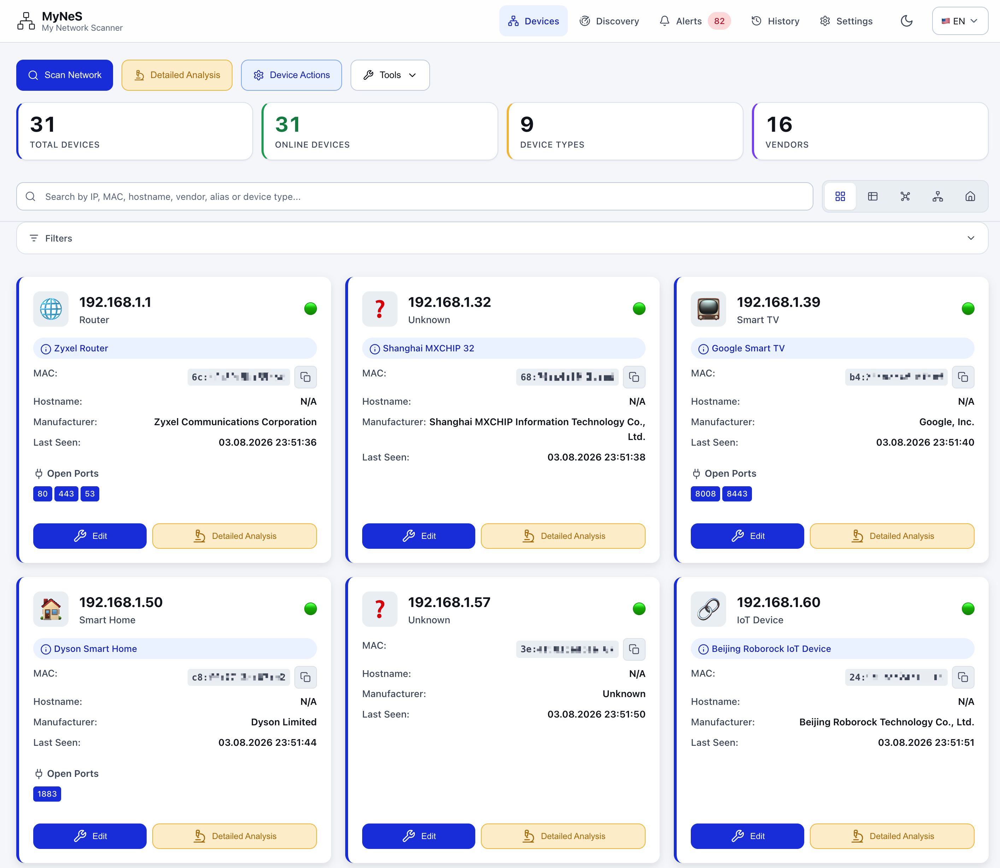

# My Network Scanner (MyNeS)

[**Beni Oku (Türkçe)**](../README.md) | **Readme (English)**

**My Network Scanner (MyNeS)**, developed with the motto "***Your Family's User-Friendly Network Scanner***", is a professional application that scans all devices in your local network (Router/Modem, Laptop, Tablet, Desktop, Server, IP Camera, Gaming Console, Smart Home Appliances, etc.), collects detailed information about detected devices, and allows you to manage your devices through a user-friendly and easy interface.

It simplifies network management with a modern and user-friendly web interface. It offers advanced and detailed scanning, AI-powered device identification, and security features.



> Full per-release detail: [**CHANGELOG.md**](../CHANGELOG.md)

## ✨ Features

- 🌐 **Web-based Interface** - Modern, responsive, user friendly web UI
- **🔍 Automatic Network Discovery**: Automatically determines local network range
- **🔬 ARP Scanning**: Uses ARP protocol for fast device discovery
- **🔌 Advanced Port Scanning**: Comprehensive service detection with 1000+ ports
- **🖥️ Device Type Detection**: Automatic detection of routers, computers, phones, cameras, etc.
- **🐳 Docker Integration**: Container and virtual network detection
- **🔐 Multi-Protocol Analysis**: SSH, FTP, HTTP, SNMP support
- **📝 Device Management**: Edit device information, add custom attributes, manual ports
- **🎛️ Export/Import**: Easy JSON-based data exchange for detected devices
- **📊 History Tracking**: View past scans and statistics
- 🌍 **Multi-language** - Turkish and English language support

### 📊 Detailed Device Information

- **IP Addresses**: IPv4 addresses
- **MAC Addresses**: Physical network addresses
- **Hostname**: Device names
- **Vendor Information**: Advanced vendor detection with IEEE OUI database and online APIs
- **Open Ports**: Active services and port numbers
- **Device Type**: Automatic device categorization
- **System Information**: Operating system, hardware specifications
- **Security Analysis**: Vulnerabilities and security status
- **Docker Information**: Container status and network mapping

### 🏭 Advanced OUI/Vendor Management

- **Multi-Source IEEE Support**: Supports OUI, MA-M, OUI-36, IAB, CID records
- **Automatic Updates**: Download current database from IEEE sources
- **Online API Fallback**: Automatic online search for unknown MACs
- **37,000+ Vendor Records**: Comprehensive vendor database
- **Smart Vendor Cleaning**: Normalize organization names

### 🎯 AI-Powered Smart Device Recognition

The application automatically determines device type using the following information:

- **Hostname Analysis**: Pattern recognition from device names
- **Vendor Information**: Vendor-based classification
- **Open Port Analysis**: Service-based detection
- **Known Device Signatures**: Confidence scores with machine learning
- **Smart Naming**: Automatic alias and name generation

### 🔐 Enhanced Security Features

- **Encrypted Credential Storage**: Military-grade Fernet symmetric encryption
- **Multi-Protocol Access**: SSH, FTP, HTTP, SNMP credential management
- **Data Sanitization**: Security-focused data cleaning for export
- **Secure File Permissions**: Hidden key files with restrictive permissions (600)

### 🐳 Docker & Virtualization

- **Docker Container Detection**: Running container identification
- **Virtual Network Mapping**: Docker network and IP assignments
- **Container Information**: Detailed container metadata
- **Network Isolation**: Container network communication analysis

### 🗺️ Five views

The device list can be read five ways, switched from the toolbar.

| View                | What it is for                                                                   |
| ------------------- | -------------------------------------------------------------------------------- |
| Cards / Table       | Detail and bulk editing                                                          |
| **Graph**     | The whole network at a glance; subnet gateways as hubs                           |
| **Topology**  | What is plugged into what:`Internet → router → switch/AP → group → device` |
| **Home plan** | Drag devices onto a plan of your home                                            |


### 📡 Multi-protocol discovery

An IP scan misses half a home network. MyNeS listens to everything that
announces itself: mDNS/Bonjour (printers, NAS, Chromecast, HomeKit), Matter,
SSDP/UPnP (routers, smart TVs, cameras, consoles), Bluetooth LE (*devices with
no IP at all*) and Zigbee/Z-Wave over MQTT.


### 🔔 Monitoring, alerts and notifications

Scans on a schedule, diffs consecutive scans and reports what matters: new
device, device offline, IP change, **MAC change (ARP spoofing)**, newly opened
port, under-voltage (Raspberry Pi power problems), low battery, high latency,
weak signal.

Delivery: **MyNeS's own push** (Web Push — no Home Assistant and no third-party
service in the path), a **Home Assistant `notify` service**, ntfy, Telegram,
webhook, Slack, Discord and email.


### 📱 On a phone

The app is a PWA: installable to the home screen, follows the OS light/dark
preference, and lays out from a 320px phone up to a TV.

<p>
  
  
</p>

### 📈 History and statistics


### 🔬 Detailed device analysis


### 🏭 OUI / vendor database


## 🚀 Quick Start - Docker

[](https://hub.docker.com/r/fxerkan/my_network_scanner)
[](https://hub.docker.com/r/fxerkan/my_network_scanner)
[](https://github.com/fxerkan/my_network_scanner/releases)
[](https://github.com/fxerkan/my_network_scanner)

The image is published for `linux/amd64` and `linux/arm64`, so it runs on a Raspberry Pi
or Orange Pi as-is.

### 🐳 Docker Compose (recommended)

```yaml
services:
  mynes:
    image: fxerkan/my_network_scanner:latest
    container_name: mynes
    # Host networking is what lets it actually see the LAN. See the note below.
    network_mode: host
    cap_add:
      - NET_ADMIN
      - NET_RAW
    volumes:
      - ./data:/app/data
      - ./config:/app/config
    environment:
      MYNES_PORT: 5883
      # Auto-generated on first start if left empty.
      MYNES_PASSWORD: ""
      # Optional: reveals Zigbee2MQTT / Z-Wave JS / Tasmota devices
      MYNES_MQTT_HOST: ""
      # Optional: Home Assistant integration
      HA_URL: ""
      HA_TOKEN: ""
    restart: unless-stopped
```

```bash
docker compose up -d
```

Or use the file in this repo: `docker compose -f deploy/docker-compose.yml up -d`

### 🐳 Docker Run

```bash
docker run -d \
  --name mynes \
  --network host \
  --cap-add=NET_ADMIN \
  --cap-add=NET_RAW \
  -v "$(pwd)/data:/app/data" \
  -v "$(pwd)/config:/app/config" \
  -e MYNES_PORT=5883 \
  --restart unless-stopped \
  fxerkan/my_network_scanner:latest
```

Web UI: **http://\<your-server-ip\>:5883**

### ⚠️ Why host networking and NET_RAW?

MyNeS sends raw ARP frames and listens for mDNS/SSDP multicast. Both require the host
network namespace — from a bridge network it can only see the bridge, not the LAN.

- `NET_RAW` lets it build ARP frames.
- `NET_ADMIN` lets it read interface state.
- It does **not** run as root (`USER scanner`, uid 1000) and it is **not** `privileged`.
- Without these capabilities it does not fail: it degrades to a ping sweep plus the OS ARP
  cache and finds fewer devices. `/api/capabilities` tells you exactly what is missing.

Docker Desktop (macOS/Windows) does not fully support host networking. There, drop
`network_mode: host` and use `ports: ["5883:5883"]` instead, accepting reduced discovery.

> Only scan networks you own.

### 🔧 Environment Variables

| Variable | Description | Default |
| --- | --- | --- |
| `MYNES_PORT` | Web interface port | `5883` |
| `MYNES_PASSWORD` | Master password encrypting stored device credentials | auto-generated |
| `MYNES_MQTT_HOST` | MQTT broker host (Zigbee/Z-Wave/Tasmota discovery) | empty |
| `MYNES_MQTT_USERNAME` / `MYNES_MQTT_PASSWORD` | MQTT credentials | empty |
| `HA_URL` / `HA_TOKEN` | Home Assistant URL and long-lived token | empty |
| `TZ` | Container timezone | `UTC` |

`HA_URL` / `HA_TOKEN` are accepted too. A `.env` file in the repo root is read by every
entry point; real environment variables always win over the file.

### 📁 Persistent Volumes

| Path | Contents |
| --- | --- |
| `/app/data` | Device inventory, scan history, alerts |
| `/app/config` | Configuration and encrypted credentials |

## 🛠️ Development

- Python 3.7 or higher
- Nmap (system-wide installation required)
- Root/Administrator privileges may be required for port scanning
- Docker (optional - container detection )
- SSH/FTP/SNMP tools (advanced detections)

### 1. Nmap Installation

**macOS:**

```bash
brew install nmap
```

**Ubuntu/Debian:**

```bash
sudo apt-get update
sudo apt-get install nmap
```

**CentOS/RHEL:**

```bash
sudo yum install nmap
```

### 2. Code Installation

1. **Clone the repository:**

```bash
git clone https://github.com/fxerkan/my_network_scanner.git
cd my_network_scanner
```

2. Create Virtual Environment

   ```
   python -m venv .venv

   source .venv/bin/activate
   ```
3. **Install dependencies:**

```bash
pip install -r requirements.txt
```

3. **Run the application:**

```bash
python app.py
# or use the startup script
./start.sh
```

4. **Access the web interface:**
   Open your browser and navigate to `http://localhost:5883`

### Quick Commands

```bash
# Run network scan (command line)
python lan_scanner.py
```

### Configuration

The application supports various configuration options:

```bash
# Set master password for credential encryption
# (LAN_SCANNER_PASSWORD is still accepted as a legacy alias)
export MYNES_PASSWORD="your_master_password"

# Custom Flask configuration
export FLASK_SECRET_KEY="your_secret_key"
```

## 🔧 Configuration Files

```
config/
├── config.json              # Main application settings
├── device_types.json        # Device type definitions
├── oui_database.json        # Local OUI database
├── .salt                    # Cryptographic salt (hidden)
├── .key_info                # Key derivation info (hidden)
└── *.csv                    # IEEE CSV files (auto-downloaded)

data/
├── lan_devices.json        # Device scan results
├── scan_history.json       # Scan history
└── backups/                # Automatic backups

locales/<language_code>
├── translations.json        # Language_Code based Translation texts
└── device_types.json        # Device Types translations
```

## 🛠️ Technical Architecture

### Core Technologies

- **Backend**: Python 3.7+ with Flask
- **Network Scanning**: Nmap, Scapy, ARP
- **Security**: Cryptography, Fernet encryption
- **Data Storage**: JSON-based with encryption
- **Frontend**: Modern HTML5/CSS3/JavaScript
- **Database**: IEEE OUI database with 37,000+ entries

### Key Components

1. **LAN Scanner Engine** (`lan_scanner.py`) - Core scanning functionality
2. **Enhanced Device Analyzer** (`enhanced_device_analyzer.py`) - Advanced analysis
3. **Smart Device Identifier** (`smart_device_identifier.py`) - AI-powered identification
4. **Credential Manager** (`credential_manager.py`) - Encrypted credential storage
5. **Docker Manager** (`docker_manager.py`) - Container detection
6. **OUI Manager** (`oui_manager.py`) - Vendor database management
7. **Data Sanitizer** (`data_sanitizer.py`) - Security data cleaning

### Multi-Language Support

- **Languages**: Turkish and English
- **Dynamic Switching**: Real-time language changes
- **Translation Management**: JSON-based translation files
- **Template Integration**: Jinja2 template support

## 🛡️ Security Best Practices

- **Network Permissions**: Requires appropriate network scanning rights
- **Firewall Alerts**: May trigger security software alerts
- **Authorized Scanning**: Only scan networks you own or have permission to scan
- **Credential Security**: All credentials encrypted with military-grade encryption
- **Data Protection**: Sensitive data automatically removed after advanced analysis and during export

## 🤝 Contributing

We welcome contributions! Please feel free to submit a Pull Request.

1. Fork the repository
2. Create your feature branch (`git checkout -b feature/AmazingFeature`)
3. Commit your changes (`git commit -m 'Add some AmazingFeature'`)
4. Push to the branch (`git push origin feature/AmazingFeature`)
5. Open a Pull Request (Claude and GitHub CoPilot Actions will review it )

- **Issues**: [GitHub Issues](https://github.com/fxerkan/my_network_scanner/issues)
- **Discussions**: [GitHub Discussions](https://github.com/fxerkan/my_network_scanner/discussions)

## 🐛 Troubleshooting

### Docker Common Issues

**Port 5883 already in use:**

```bash
# Check what's using the port
sudo lsof -i :5883

# Use different port
docker run -p 8883:5883 fxerkan/my_network_scanner:latest
```

**Permission denied for network scanning:**

```bash
# Ensure privileged mode and capabilities
docker run --privileged --cap-add=NET_ADMIN --cap-add=NET_RAW fxerkan/my_network_scanner:latest
```

## 🔄 Changelog

Full per-release detail: [**CHANGELOG.md**](../CHANGELOG.md)

## 📄 License

This project is licensed under the MIT License - see the [LICENSE](LICENSE) file for details.

## 🔗 Links

- **GitHub Repository**: [https://github.com/fxerkan/my_network_scanner](https://github.com/fxerkan/my_network_scanner)
- **Documentation**: [CLAUDE.md](CLAUDE.md)
- **Turkish README**: [README.md](README.md)

## 🙏 Acknowledgments

- **[Claude Code](https://www.anthropic.com/claude-code)**: AI-assisted development
- **[IEEE](https://www.ieee.org/)**: OUI database
- **[Nmap](https://nmap.org/)**: Network scanning engine
- **[Flask](https://flask.palletsprojects.com/en/stable/)**: Web framework
- **[Python](https://www.python.org/)**: Libraries and tools

---

**Made with ❤️ & 🤖 by [FXerkan](https://fxerkan.com)**

**Important:** This tool should only be used for training purpuse on your owned network only.

**Warning:** Scanning other people's networks without permission is illegal, and My Network Scanner (MyNeS) does not recommend or support such use.
